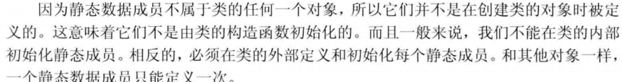
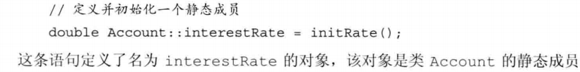

类：
可以先声明不定义
两个不同名字的类即便成员完全一致，他们也是完全不一样的类型（不是一个作用域的）

类成员的编译即作用域： p 254
{ }作用域里面声明的函数，对象都叫做类的数据成员，在声明时书写顺序可以不管顺序，因为编译器至始至终都是先编译数据成员，再编译成员函数，等整个类可见后，再编译函数的定义（内部定义）；所以外部和内部同名的对象，内部任何位置的对象访问级别都比外部优先
数据成员 → 成员函数 → 函数定义

typedef 自定义一个类型的时候尽量使用在
作用域开始的位置，避免和外部重定义冲突（有些编译器检查不到这种错误）——可以使用: :显示访问外部对象，this 访问内部

成员函数：可以直接定义在类内部，内部定义的函数是隐式内联的，也可以定义在外部，定义在外面必须和声明保持一致，函数名字也得用 类::函数名 指明他所属类

类的非成员函数：
一些类的辅助函数，他们不属于类本身，概念上来说属于类的接口组成部分；他们通常与类声明在同一个头文件，定义在其他文件，方便统一引用

this:
一个指向类类型的常量指针，指向非常量的指针，当在一个类的成员函数里调用同类成员可以直接访问成员（隐式 this）;函数（）后面加上 const 可以吧 this 声明为指向常量的指针，使其可以指向常量，提高灵活性
const 成员函数返回的\*this（被保留底层 const） 是一个 const 对象，所以不能改变他（修改他的数据成员）
返回值使用 this 时注应该返回 引用类型（&）才可以达到更新左值目的——而且效率比副本传递高

常量成员函数：在函数定义的括号后加上 const，在该函数内不可修改类数据成员;括号前加上 const 将 this 声明为指向常量的指针；const 有助于提高灵活性，可以访问常量或非常量成员，对成员也有保护作用——可根据此项重载
mutabel:修饰一个数据成员，使其可以在 const 函数内可以被修改，不可修改本身就是 const 的成员

声明注意：
T t()；这是一个 T 返回类型不带参数的函数声明，并不是一个 T 对象——C++允许函数中的函数

构造函数：
与类名相同没有返回类型，不能声明为 const;; 通过一个或几个特殊的成员函数来对类数据成员的初始化就叫构造函数。——类的对象被创建就会执行构造函数。

默认构造函数
fun()=default; default 在声明时创建则是内联构造，反之在定义时创建
一个类的成员只有在创建时才被完成初始化，也就是执行构造函数时，所以构造函数可以对 const 成员进行初始化
没有构造函数时会执行隐式的合成默认构造函数
有些编译器不支持类内初始值，则只有当这些全部成员被赋予了类内的初始值才能使用合成默认初始值，如果编译器不支持类内初始值则每一个构造函数都应该显示的初始化每个内置类型成员——不要轻易覆盖类内初始值， 不然最好显示初始化所有内置类型成员，以便适用不同编译器
如果一个类中包含一个其他类类型成员没有默认构造函数，编译器将无法对这个类执行默认构造函数，可以手动添加默认初始值
如果一个类的成员是 const,引用时必须声明就得初始化，则只能使用：
x(初始值) 这种构造函数格式，定义构造函数体内声明也不行(相当于再次给 const 赋值)，应该习惯性的使用构造函数格式，而不是定义函数的方式
如果一个构造函数为所有参数列表都提供了默认初始之，实际上是定义了默认初始函数

构造函数初始值列表
（）对象（）…{}
如果可能的话尽量避免在构造函数时使用一个成员去初始化另一个成员，因为编译器初始化时顺序不一定，使用形参进行初始化是最合理的；顺序列最好和声明列表保持一致
如果没有显示使用初始化列表,在函数体进入之前会执行默认初始化
如果有成员是 const、引用则只能使用在列表进行这种方式初始化，进入函数体内属于二次赋值

委托构造函数：
使用其他构造函数初始化自己；f()：fn() {自己的函数体}
执行顺序：受委托的构造函数初始化列表和构造体依次执行，然后返回委托者构造体执行

class 成员默认访问权限是 private，struct 是 public

类中声明自己的对象
static T t
\*T t
静态和指针都可以是不完全类型

友元：
可以设定几种友元：函数、类，一个类的某函数
friend：使其他函数或类可以访问自己的私有成员
只能再类内部声明，位置不限，通常放在首或尾，对于函数跟函数原型类似，只是需要在前面加上 friend 关键字
友元不具有传递性，A 是 B 的友元，B 是 C 的友元，C 不能访问 A
友元声明并不能当做普通意义上函数声明，很多编译器不支持这样的做法，但是 IDE 不会报错

转换构造函数：
能通过一个实参调用的构造函数定义了一条从构造函数的参数类型向类类型隐式转换的规则
直接通过传递该构造函数需要的参数类型的参数则可以隐式调用该构造函数，但是以这样的方式是传递的临时对象
不能使用 2 步隐式转换；例如：字面值->string->构造函数；用第三步或者第二部接受第一步的值可以解决
explicit 修饰可以阻止这种隐式转换调用此构造函数；同时这个构造函数只能用 t（）调用，不能使用=方式，一般也不会这样用
接受一个参数的 vector 构造函数就是 explicit 类型
强转例子，调用了接受一个 string 的构造函数

聚合类：

这种类初始化使用{ }按声明顺序赋初始值
显示初始每一个数据对象的副作用：可能提供错的初始值，删除一个成员后必须更新所有初始化语句

\*字面值常量类：p267 ——感觉意义不大 所有成员的 值 都是确定的

静态类成员：
在类对象创建之前就已经被创建
static 成员被有所类对象共享；
static 函数也没有 this 指针，也不能声明为 cosnt，同样被所有类对象共享
虽然静态成员函数不属于某个类对象，但是任然可以用类对象、引用或指针来访问静态成员，
还可以使用作用域运算符 T：：访问静态数据成员
静态成员函数结构体中可以直接使用静态数据成员
静态成员对象可以作为构造函数的默认实参
静态成员函数既可以在类内也可以在外部定义（通常在函数定义文件中），但是 static 修饰只能再类内的声明语句

虽然定义在外部依然可以访问类的成员数据

static constexpr 成员
我们可以给静态成员对象提供 const 整型类型类内初始值， 不过要求这个静态对象是 constexpr 的
即使在类内初始化了一个常量静态成员，也应该在外部定义一下，以便其他地方访问
