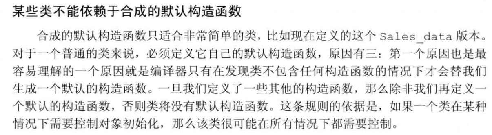

低效的抽象编程模型，可能在两年之后你会注意到有些抽象效果不怎么样，但是所有代码已经依赖于围绕它设计的‘漂亮’对象模型了，如果不重写应用程序，就无法改正。——不要滥用继承、抽象

类：

## 初始化构造：

基类通常都应该定义一个虚析构函数，即便该函数不执行任何实际操作
每个类控制他自己的成员初始化过程，派生类也得使用构造函数初始化继承的基类部分
基类出现派生类对象显然是非法的
使用初始化参数列表形式构造基类{ :基类名(参数列表),派生类初始化列，… }，不写则执行默认初始化；先执行基类初始化，然后再按照声明顺序初始化派生类

下面的静态类型是指对象本身的类型

访问权限转换及友元：友元不具备继承性
protected：受保护的,能被派生类和派生类的友元访问，但只能通过派生类的对象（实例）访问，不能通过基类的对象来访问
基类的友元具有基类的所有访问权限，所以派生类对象在基类的友元里也将具有所有权限；
//块作用域内拥有基类的私有级别访问权限，则这个派生类可以在该块访问私有级别的基类成员
派生类的成员声明了与基类相同成员，基类的成员将被隐藏，但可以用作用域运算符显示访问

#### 派生列表访问说明符号：

class 默认访问符为 private，struct 为 public——默认派生访问符和成员访问符是 class 和 struct 所有的区别
这里的访问权限用于限制使用该派生类的用户和他的派生类是否可访问他的基类（当然该限制对友元无效），例如访问符为 private，相当于把继承来的成员都添加了私有访问权限
使用 using 可以将指定成员对象或成员函数从保护级别提取出来，使派生类用户可以访问，访问权限依然要取决于基类限制
using 还可以用于部分函数重载时，如果要访问未重载部分，则必须使用 using 标记——using 函数名，不需要声明每一个函数重载

友元不具备继承性，每个类控制各自成员的权限

## 虚函数 virtual:

对于一些函数，基类希望他的派生各类中自定义适合自身的版本，此时基类就将这些函数声明成虚函数
任何构造函数之外的非静态函数都可以是虚函数
修饰符只能出现在类内声明函数处，不能在外部定义函数处
基类声明一个虚函数，则该函数在所有派生类中都隐式是虚函数，且不需要显示标明 vritual 标明也无害
如果一个派生类没有覆盖基类的虚函数，则该虚函数与普通函数没有差异
虚函数也可以定义默认实参，如果在一次调用中使用默认实参，则是使用的是静态类型的实参，即便动态绑定了其他派生类也如此，所以如果虚函数要使用默认实参，则派生类最好一致，以免带来不解的困惑

#### 动态绑定：

当我们使用基类的引用或指针调用一个虚函数时将发生动态绑定，因为编译器也无法知道调用了哪个虚函数，运行时才能确定调用了基类的还是派生类的，所以必须给所有虚函数都提供定义部分
可以用作用域运算符::来回避虚函数机制，而不进行动态绑定，通常只有成员函数或友元才需要这种做法，还有就是 派生类虚函数需要调用他的基类版本，而没有使用回避机制，运行时解析为派生类自身的版本，则导致无限递归。

#### 直接绑定：如果使用普通对象则不会发生动态绑定，直接调用对象静态类型的虚函数。

#### 规则：

返回类型和形参类型必须完全一致，有一个例外：派生类可以是自己类型的指针或引用；其他差异将被认定为一个新的函数，隐藏基类同名函数，并没有重载效果

#### Final：

声明位置同 override
禁止再继承该被修饰的类或禁止再覆盖（重写）被修饰的函数

含有未经覆盖基类直接继承或含有纯虚函数（=0 没有定义的）的类叫抽象基类
不能创建抽象基类的对象

#### 静态：

无论多少派生成员都共享一个(非私有)静态成员(static)实例

## 类型与转换：

把派生类传递给基类执行的是基类的构造函数或拷贝/移动赋值运算符，只拷贝，移动或赋值基类有的成员，切掉（sliced down）派生特有的成员
基类的指针或引用的动态类型可能与其静态类型不一致,如果是非指针或引用则静态与动态类型必然一致的
因为一个基类对象可能是派生类的一部分也可能不是，所以基类不能向派生类自动转换
基类的引用或指针绑定了一个派生类对象，这个指针或引用也不能转换为派生对象（编译器根据静态类型来推断转换是否合法），但可以使用 dynamic_cast 来请求转换，该转换将在运行安全检查；同样如果我们已知谋个基类向派生类转换是安全的，则可以使用 static_cast 来强制覆盖掉编译器的检查工作

继承设计：

===
override 用于重写基类虚函数新的实现，用于实现多态，调用时动态绑定基类或派生类不同版本

---

## overload 相同的函数名，参数个数或参数类型不同，重载适应不同需求，面向过程中就有的概念

## 重构，软件要适应需求的时代变化，不需要改变外部功能（用户层），只对内部的结构进行重新的整理；例如在基类和派生类中间加一层，不需要改变派生类，在两个相连的层次中新增一层—— 就像三层架构中的业务层，从数据层获取了数据，根据用户需求 加工以后再拿给视图层

三层分为 表现层，业务逻辑层，数据访问层 ——为了降低耦合
MVC 严格来讲 M+V+C=表现层

---

堆、栈、、全局数据段（静态存储区/全局变量）、常量存储区
堆栈都具有动态特性，
常量存储区用于存放 文本形式 存放：字面值 char\*p="xxx"；xxx 就放在这里；程序结束时释放
const 是一种限制，不可被正常手段更改，所以 const 和普通变量存储区是一样的，非 static：局部的在栈中，全局的在全局数据段；
static 不管全局还是局部全部放在 静态存储区 都是编译时确定值，地址是固定的

interface 和 abstract 都不能被实例化

interface 接口里面不能有方法的实现，一旦继承就必须定义全部方法，也就代表了不能有 virtual 虚方法（2 者概念冲突），
