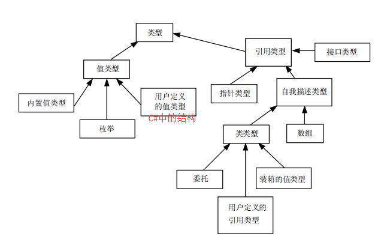
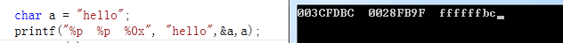

类型系统增加了,代码可读性;而且使代码很容易重构

每个 main 函数正常结束都返回 0,通常操作系统都将状态码 0 表示为正常结束程序

C 语言在函数外的声明不进行初始化——值是不确定的
C++在函数外的声明初始化为 0
但是两种语言在函数外的声明只能初始化一次且必须为常量

int，int[10]两个独立的类型，一个是 4 字节（DWORD），一个是 40 字节；自定义类型可根据内置类型、结构和类创建；被实例化的类型即成为一个 对象

public 和 private 对象在底层是不存在的，只是在文本分析时作用

递归这样算法通常不被编译器优化

程序组成：
内置数据类型：bit byte char int double float...
自定义数据类型： class struct ->高级数据类型 ：继承 接口 泛型 多态 封装
数据管理：容器(array、vector、list)
控制指令：if else switch while for try

CTS:通用类型系统
两种不同的编程语言,如果要使其一方能调用另一方,他们两个必须统一类型, 这时可以可以将他们映射为通用类型

## %p

A 有自己的地址 值= BC =“hello”0091FDBC 低 8bit
char a = "hello";
等同于
char \* p = "hello";
char a = (int)&p; 的低 8bit
