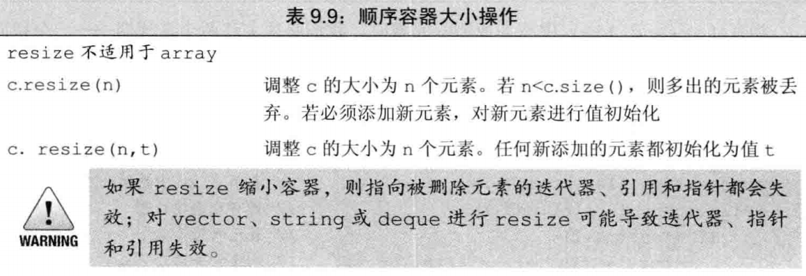

vector 和 string 在新增元素时，通常都会要求新增空间，新的元素和旧的元素都会被复制到新的空间，并释放原来的空间，被要求新空间时，通常都会分配比要求新空间被大的空间，作为备用，这样不必每次都请求都重新分配;额外空间分配方式取决于标准库实现；例如分配已使用空间多一倍的空间、斐波拉契数增长

提供单个参数的版本，这个类必须有能够使用默认构造函数或者手动提供初始值

size:
已占用内存元素总和
capacity:
获取容器的可容纳元素个数，已使用和未使用的和，至少等于 size
resize:
调整容器为指定数目,改变的是容器中元素的个数（size），没有释放空间的效果，超过 capacity 有分配效果
reserve:
请求的空间小于等于已有的空间什么也不做，大于则增加到请求的大小(可能更大：依赖于标准库实现——对齐边界)
shrink_to_fit:
将容器内存大小调整为已使用(size)大小，释放多余空间——其实不一定会被退回

insert 操作时 size 与 capacity 已相等，或者调用 resize 或 reserve 给定的大小大于 capacity 时才会给容器申请空间

对于 vector push_back 效率永远最高，技术角度来看就是使用 push_back N 次来创建 N 个元素，有足够空间时 push_back 不会增加空间

vector 中的元素在内存中是连续存放的，所以需要 capacity 这个东西~
list 没有 capacity 是因为其存储元素的内存是不连续的，不需要 capacity
array 是因为其大小是固定的

