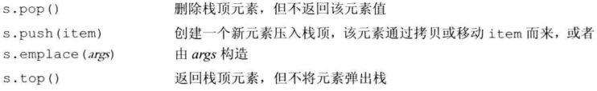

适配器是标准库中一个通用的概念；容器 迭代器和函数都有适配器。本质上适配器是一种机制，能是某种事物的行为看起来更像另一种事物；
每个适配器都定义两个构造函数，一个默认构造函数创建一个空对象，接受一个顺序容器的构造函数来初始化适配器。

array、forward_list 和 string（不是顺序容器）不能用于构造适配器，所有适配器都要求容器具有添加删除功能，适配器本身也都具有添加、删除以及访问尾元素的功能

适配器使用容器构造，实际上是间接调用容器自身的操作函数，但是他依然不能直接使用容器本身的操作函数； 用 queue 适配 vector 不能使用 pop（对应 vector 不具备的 pop_front），否则运行时错误；stack 的 pop 由于先进后出原则调用的是 pop_back

## stack

stack 要求容器具有 push_back、pop_back、back 操作(vector、list、deuqe);默认值基于 deque 容器——先进后出

默认容器可使用第二个参数<type,容器>来重构

## queue

queue 要求容器具有 push_back、push_front、back、front 操作(list、deuqe);默认值基于 deque 容器——先进先出

priority_queue 要求容器具有 front、push_back、pop_back 操作和随机访问能力（vector、deque）；默认基于 vector——标准库按优先级从高到低
