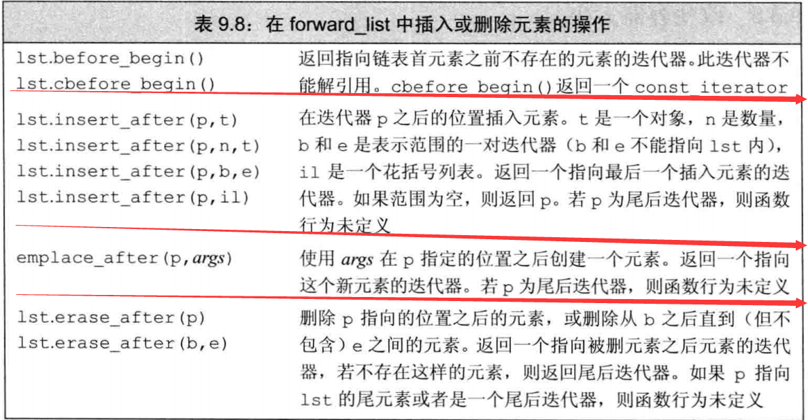

对于 string 和 vector 的迭代器都支持+、-算术运算符和关系运算符;但是运算符的两个参数的迭代器必须是指向的同一对象:算术结果无符号类型 diffrerence_type(索引所需类型)

添加、删除 vector 和 string 的元素后或在 deque 首元素之外任何位置添加、删除元素 end 迭代器总是会失效，所以在这些操作后一定要从新调用 end 迭代器

## 五种迭代器类别

输入、输出、前向、双向、随机访问

一个泛型算法要求有最小类别至少与其能力(输入输出，访问)相当，；向一个算法传递错误类别迭代器的问题，很多编译器不会给出警告

## 迭代器:

——迭代通常被称为循环，迭代器增量，减量
标准库迭代器都使用两种类型:
iterator 能读和写
const_iterator 只能读取不能写入（常量只能使用此类型）C++11
可以将 iterator 转化为 const_iterator
一个常量使用普通 bigen 也将获得 const_iterator 类型

p= s.begin():首迭代器 s.end():尾后迭代器
这两个运算函数返回的对象如果是常量则为 const_iterator

p->q: 解引 p 并获取元素 q，等价于(\*p).q
遵循一个好习惯不需要写操作时都应该使用 cbegin 和 cend

## 插入迭代器：

该下列函数接受一个容器对象，返回一个插入迭代器——iterator
back_insertr 创建一个使用 push_back 的插入迭代器(指向 push_back 的指针)
front_insertr 创建一个使用 push_front 的迭代器
——支持 push_front 时，才能使用 front_insertr，只有在容器支持 push_back 时，才能使用 back_insertr
insertr 创建一个使用 insert 的迭代器。此函数接受 2 个参数，第一个参数是容器对象，第二个参数必须是一个指向给定容器的迭代器，元素将被插入到给定迭代器所指定的元素前面
\*t ++t t++ ——这些迭代器操作没有任何作用,即便他是合法的

流迭代器：p359
这些迭代器将流当做一个特定的元素序列来处理，通过使用流迭代器，我们可以使用泛型算法从流对象读写数据
istream_iterator——读取输入流

Ostream_iterator——向一个输出流写数据数据

反向迭代器：
除了 forward_list 和 IO 迭代器，都支持反向迭代器

# 删除

返回值为最后一个被删除元素之后的一个元素的迭代器
操作类似于添加 ↓

在删除元素之前！c.empty()检查非空是个好习惯,避免行为未定义错误
删除元素的成员函数并不检查其参数，在删除之前，必须保证元素是存在的

## forwarf_list

需要很高效的在任意位置增删的场合才使用

不支持一些操作例如 pop_back，猜测：实现技术来看 pop_back 是删除他的尾迭代器，所以不允许
vector、和 string 不支持 fornt 可能因为会造成大量数据移动，所以不做支持，但技术上是可以实现的

forward_list 类模板被设计得非常高效。他被设计得如同 C 语言的单向链表一样，为了效率考虑，有意不提供 size 成员函数。因为如果要实现 size 成员函数的话，为了常量时间的考虑，就必须保持一个内部计数器记录 forward_list 的大小。这会消耗额外的存储空间，并且会让插入，删除操作变得更慢。为了获得一个 forward_list 对象的大小，可以使用 distance 算法来计算 begin 和 end 之间的距离，这个操作是线性时间复杂度的。
与 list 对比他少一个元素指针 near,少一个 size 计数器；
32 位系统差不多每次增删可以少处理 8 字节

