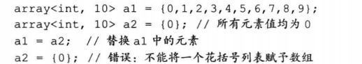
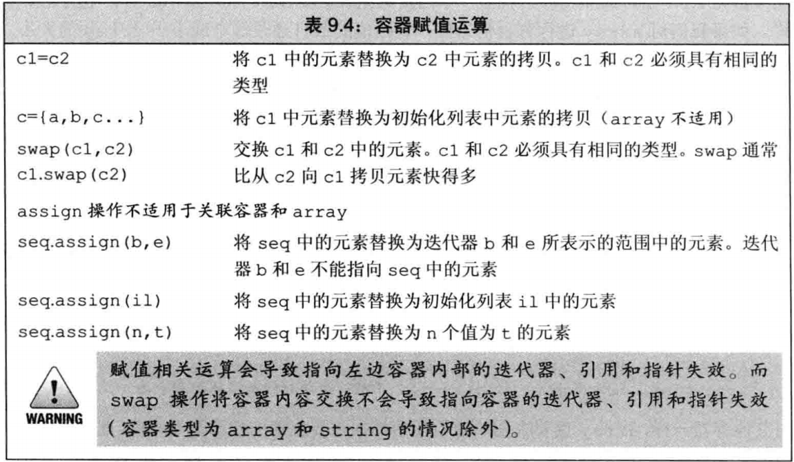
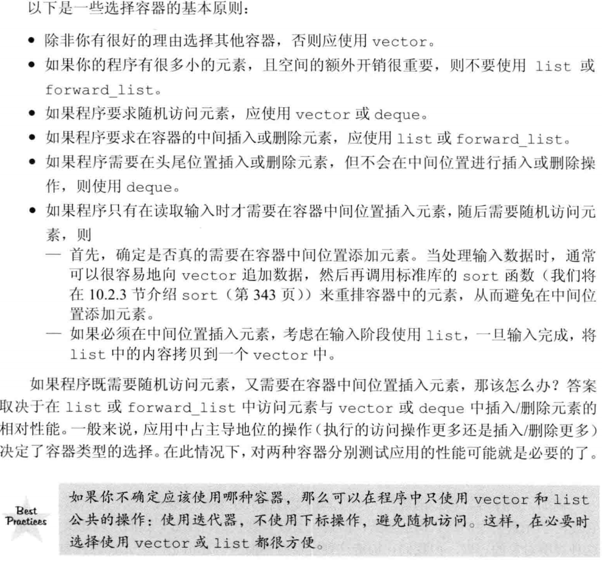

C++应使用容器，而不是内置的数组——一般情况使用 vector
std 有容器的声明，定义在容器对应的头文件中，如果只包含了 std 会出现不完整类的错误
除了 array 每个容器都有一个默认构造函数

## 迭代器可以返回的类型:

size_type 无符号
difference_type 用来表示两个迭代器之间的距离，容器的最大容量。
iteration 可读可写
const_iteration
value_type 元素的类型
reference 元素的左值类型(即 value_type&含义相同)
const_reference

# initializer_list: 同名函数头

一种标准库类型，用于表示某种特定类的值的数组，元素类型都相同
和 vector 一样是模板类型，但是他的元素永远是 const 类型

## 获取元素

#### front()、back():

所有顺序容器都有一个 front 成员函数，返回首元素引用；
除了 forward_list 所有顺序容器都有一个 back 成员函数，返回尾元素的引用;
vct1.front() = 1; //可通过引用把 vct1 首元素改为 1
auto front = vct1.front();//front 是 vct1 首元素的拷贝，并不是一个引用
auto &front1 = vct1.front();//front1 是一个引用，可修改首元素

#### begin()、end():

返回 首和尾后的迭代器 返回类型 iterator
以 r 开头的返回反向迭代器 返回类型 iterator
以 c 开头的返回 const 迭代器； 返回类型 const_iterator
以 cr 常量反向迭代器 返回类型 const_iterator
以 C\*开头的都是 C++11 新标准

解引用一个迭代器和调用 front、back 之前！使用 c.empty()检查非空是个好习惯,避免行为未定义错误
[n] 访问 不检查越界，越界则运行时错误
安全的下标和随机访问：
使用成员函数 at(n)，如果给定的下标 n 越界 at 会抛出 out_of_range 异常；

容器的左闭合范围[begin,end]

容器的三个大小相关成员函数
size()容器大小 empty()容器是否费为空 max_size()容器最大容量
forward_list 不支持 size

#### 关系运算操作：

每个容器类型都支持==、!=；除了无序关联容器都支持关系远算符（>、>=、<、<=），实际对两个容器进行元素逐对比较，规则与 string 的比较规则类似;关系运算运算符左右两边运算对象都必须是相同类型的容器，且相同类型的元素类型；只有当元素类型能使用(内置类型)比较运算符时容器才能进行关系运算——自定义类类型要进行关系运算,则需要定义重载运算符

编译器并不强制要求 begin 大于等于 end,符合约定由程序员负责

## 初始化：

使用一个容器初始化另一个容器，容器类型和元素类型都必须相同，例如 vecotr<char*>与 vacotr<string>不能直接赋值
但是可以 vecotr<char*>（vstr.bigen()，vstr.end()），使用这种范围的方式只需要元素之间能隐式转换就行

如果只给的数目,还需要指定的自定义类型还需要定义了默认构造函数

## 赋值

赋值相关运算会导致左边容器的内部迭代器，引用和指针失效

## swap:

c1.swap(c2) 交换 c1 和 c2，比拷贝快得多——并不是元素本身交换，而是交换了容器的内部数据结构
swap 不对任何实际元素进行复制、删除和插入操作，所以速度很快；array 例外，会被交换真实元素
元素不会被移动意味着，指向容器的迭代器、引用和指针在 swap 操作之后都不会失效，array 虽然没失效但会指向被交换后的元素，string 依然会失效
——在新标准中提供了非成员版本的 swap，在泛型编程中很重要的存在，建议统一使用非成员版本的 swap

## assign:

此函数不适用于 array 和关联容器
可向类型不同,但相兼容的类型赋值
c.assign(il) 将 c 赋值为 il
c.assign(begin+n,end-n) 将范围的值赋值给 c，迭代器 b 和 e 不能指向 c 中的元素，使用从一个不同容器但元素可隐式转换的序列范围
c.assign(n,u) 将 c 赋值为 n 个为 u 元素
实参不是能调用此函数的容器元素序列

后两行位为赋值

## array:

size 不允许被改变，不适用任何增加删除操作, 容量属于类型的一部分
array<type,10>::size_type 10 个 type 类型的数组，给定大小是 array 声明的必要的部分，例外的是初始化声明{0},是把所有元素赋值为 0
array 与其他容器一样可以=接收另一个数组，array 也要求初始值的类型必须要与创建的容器类型相同，此外 array 还要求元素的个数也必须一样，因为大小是 array 必要的部分——内置数组不能是使用数组赋值另一个数组

## 容器的实现机制：

\*list（链表容器） 2 种类型的容器内存不是连续的，所有增删后改变指向的地址即可——任意位置增删效率快速
list:他的元素数据结构都储存了在他之前和之后的 2 个元素地址

## forward_list:

他的元素数据结构都储存了在他之后的一个元素地址——不应该使用 end()迭代器添加删除，比较运算,
要操作 forward_list 一个元素一定是给定这个元素之前的迭代器，例如删除 b,e 范围内的元素，受影响的元素不包含 b 和 e，返回 e（这一点与其他容器相同）;forward_list 总是操作给定迭代器之后的位置；所以 b 一定不能是尾迭迭代器或尾后迭代器
添加元素列表时，他返回最后一个元素迭代器，其他容器返回第一个元素迭代器

添加删除 string、vector 尾元素和 deque 首尾之外的任何元素都需要移动元素，而且可能引起 string、vector 重新分配空间，会移动所有元素
容器内存连续的所以增删后需要移动内存，也导致被移动的元素迭代器失效，元素越多消耗越大

## 容器的选择建议

