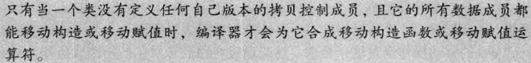
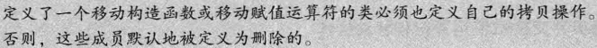
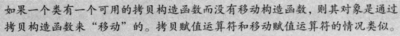
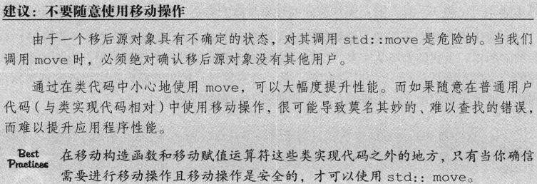
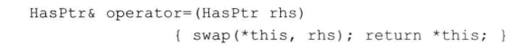
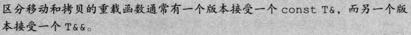
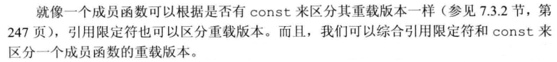
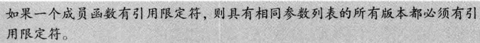
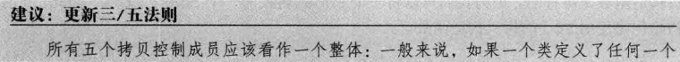
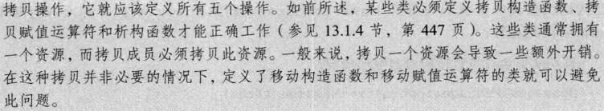

_左值拷贝，右值移动_

在定义一个类时，我们可以显式或隐式的定义在此类型的对象拷贝、赋值、移动、销毁是做什么，
主要通过五种特殊的成员函数来完成这些操作：
**拷贝构造函数、拷贝赋值运算符、移动构造函数、移动复制运算符。析构函数**
拷贝和移动构造函数定义了当用同类型的一个对象初始化本对象时做什么。拷贝和移动赋值运算符定义了将一个对象赋予同类型的另一个对象时做什么。析构函数定义了当此类型对象销毁时的操作

若一个类没有显式的定义这五个操作，编译器会自动为其定义缺失的操作，在定义一个类时，拷贝控制操作是非常的重要的
拷贝构造函数：本身是一个构造函数，其第一个参数是一个自身类类型的引用，且任何额外参数皆有默认值，通常不应该是 explicit

## 合成拷贝构造函数：

一般情况此函数会将其参数的成员（非 static）逐个拷贝到正在创建的对象中，有时还用于阻止拷贝该类类型的对象
拷贝规则：

拷贝构造函数用来初始化非引用类类型成员，这也解释了为什么拷贝构造函数实参必须是引用类型——拷贝构造函数非引用类类型形参初始化需要调用拷贝构造函，如此循环调用，则发生无限循环

## 拷贝构造函数发生在以下情况：

用=右侧对象拷贝到正在创建的对象中，如果需要还需进行类型转换
将一个对象作为实参传递给一个非引用类型形参
从一个返回类型为非引用类型的函数返回对象
用花括号初始化一个数组的元素或一个聚合类中的成员
将一个对象作为实参传递给一个非引用类型的形参时、从一个返回类型非引用类型的函数返回一个对象
某些类类型还会对他们所分配的对象使用拷贝初始化，例如初始化标准库容器或调用其 insert 或 push 成员都会进行拷贝初始化，emplace 是用直接初始化

## 拷贝赋值运算符：

与拷贝构造函数规则大同小异
拷贝复制运算符，其实就是一个名为 operator= 的函数(operator 后加表示要定义的运算符的符号)，重载运算符，有返回类型和参数，返回类型通常是左侧运算符的引用
++表达式一定要写在--表达式之前，因为会不能避免自赋值情况，如果先--为 0 了就会进行 delete

# 移动

在移动操作后，被移后的源对象必须保持有效的，可析构的状态，但用户不能对其值再做任何假设
编译器可以移动 内置类型和定义了自己移动操作的成员
移动函数不会定义隐式的删除函数,但显示的定义了=defualt 移动操作，但是编译器无法移动所有成员，则编译器会定义删除的移动操作

## 移动构造函数：

窃取不配分任何资源，因此移动构造函数不应该抛出任何异常，所以是 noexcept——承诺不会抛出任何异常，标准库能省下一些工作；但是也不排除一起其他因素造成异常，所以也可以不加 noexcept
依然是接受一个本类类型的右值引用（T&&）
他的所有指针数据成员接管传入的源对象的指针指向的内存，然后将源对象的指针全部赋值为 nullptr，避免源对象的析构释可以正常的释放他

## 移动赋值运算符：

与移动构造函数不同的是（和拷贝移动赋值运算符一样）需要考虑自赋值，
判断如果是自己的对象，则直接退出移动赋值运算，不做任何操作

## 移动和拷贝的相互作用：

make_move_iterator(迭代器)：接受一个迭代器，返回一个移动迭代器

传入不同的参数，自动调用拷贝构造或移动构造

## 右值与函数：

普通函数也可以用右值提升效率
通常右值引用都不会去绑定一个 const，因为多数情况使用右值就是为了窃取数据，const 会阻止这种行为

## 引用限定符：

跟随在参数列表后面，如果有 const，还必须在 const 后面，只能限定非 static 成员函数
&限定表示，只能用类的左值对象调用该成员函数，&&限定表示，只能用类的右值对象调用该成员函数

## 析构函数：

没有返回值，也不接受参数——不能重载
析构函数本身并不直接销毁成员，先执行析构函数体之后，再自动销毁非 static 成员，按照声明顺序逆序销毁
类作者可用于阻止该类型的对象被销毁或者在销毁成员前做一些收尾工作——例如释放动态分配的对象（非指针指针必须人为销毁）
成员销毁依赖于成员类型，类类型需要执行他自己的析构函数，内置类型没有析构函数，自动释放；
合成析构不会 delete 一个指针指向的对象，如果一个类需要动态分配数据给成员，就得自己创建析构 delelte 他

编译器合成析构函数基本为空
何时执行析构函数：
无论何时一个对象被销毁，就会自动调用其析构函数销毁其成员：

变离开作用域
对于动态类型，只有对指向他的指针使用 delete 才会被销毁
临时对象，执行完整条表达式时被销毁
一个类对象被销毁，其成员也被销毁

法则：

## 用于一些限制的拷贝

=default:
显示的要求编译器生成合版本，在类内使用则生成内联，比希望内联则应该定义在类外——只能对编译器可以合成的默认构造函数和拷贝控制函数使用

=delete：
定义为删除的函数，这样定义的函数则无法被访问——虽然主要用于禁止拷贝控制函数，其
实他可以用于所有函数；用于析构是一件非常危险的行为，定义了删除的析构类，无法定义这个类的对象，但是可以动态创建该类对象，可是无法释放这个对象
合成的 delete 函数：
本质上，当不可能拷,赋值或销毁类成员时，类的合成拷贝控制成员就会被定义为我删除的
