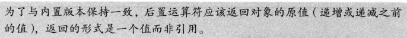
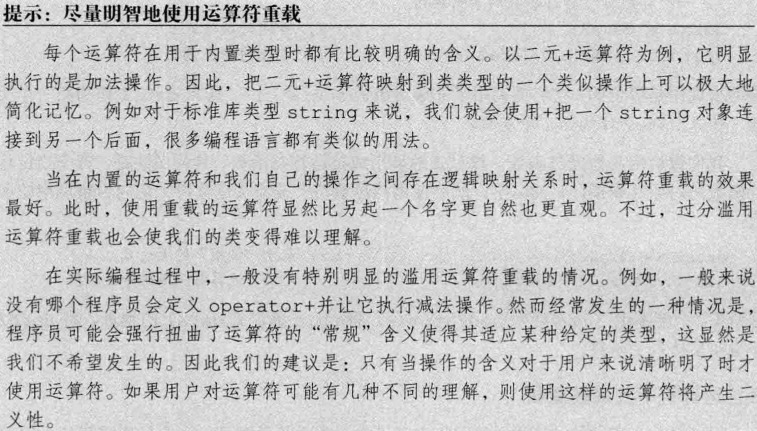
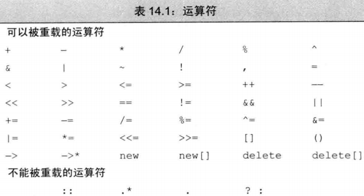

_这些函数不能是 explicit_
通常情况不应该重载逗号，取地址，逻辑与、逻辑或运算符

## 规则：

定义了算数和位运算符，则最好也提供复合赋值运算符

++ --

下标运算符[]必须是成员函数，通常会定义返回常量和非常量两个版本

通常情况不应该重载逗号，取地址，逻辑与、逻辑或运算符

## 重载 new delete

operator new 和 operator delete 默认自动为静态
返回类型必须是 void\* 第一个参数类型必须是 size_t 且不能有默认参数

noexcept:
异常说明符，指定此函数不抛出异常——写在形参的括号后面

当只传入一个指针类型的实参时，定位 new 表达式构造对象但是不分配内存
