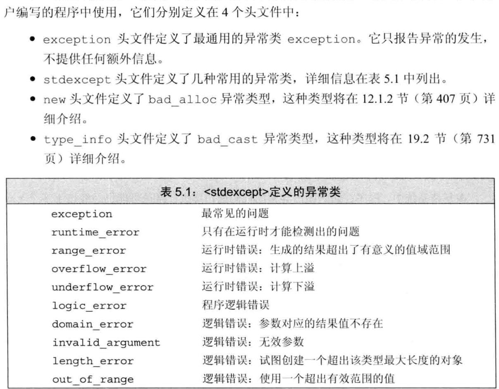

->成员访问符比 . 多一个解引作用

循环中的代码 中的条件部分和循环体内的的变量每次迭代都经历从从创建到销毁的过程——迭代通常被称为循环

ostream 类型的值无法被拷贝，但可以引用或指向他的指针

range-for：
for(auto 子项 ： 对象) 类似 foreach，auto 让编译器决定他的类型
对象：string.数组，vector 等，他们的共同特征拥有 begin,end
子项：都是对象的成员对象，通常使用 auto 确保他们是同类型，如果要对子项进行写操作，必须使用引用

goto label(标号: )

throw 表示无法处理的问题。throw 引发了异常 ；预定义的异常抛出
runtime_eorr(字符串)标准库异常处理错误类型，终止当前函数，控制权转移给异常的代码，定义在 stdexcept 头文件

try catch（错误类型） 异常部分使用 try 检查并抛出错误类型。以一个或多个 cathc 子句结束，抛出的异常通常被定义了该错误类型 catch 处理后跳出 try catch 代码接着执行
try {//代码
throw runtime_error("出错"); }
catch (runtime_error err) {cout << err.what() << endl;}//打印错误类型抛出的错误
每个一异常类标准库都定义了 what()函数，接受和返回 C 风格 const char\*

当一段代码没有 try 或者定义了 try 但是抛出的异常没有一个 catch 定义，那么程序转到名为 terminate 的标准库函数：该函数与系统有关，通常该函数导致程序非正常退出
程序非正常退出：无效或未完成的状态或没有被正常释放的资源等，都被异常安全代码执行了清理；编写异常安全代码非常困难——鲁棒

