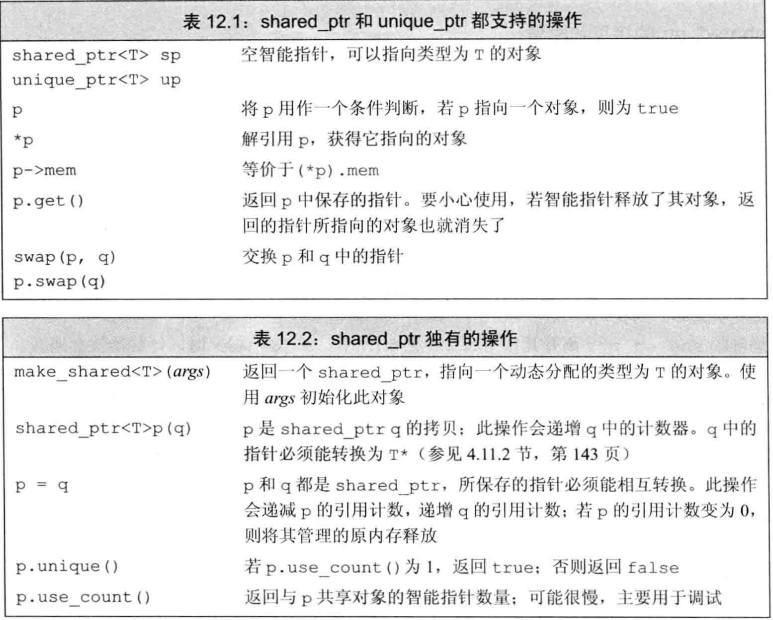
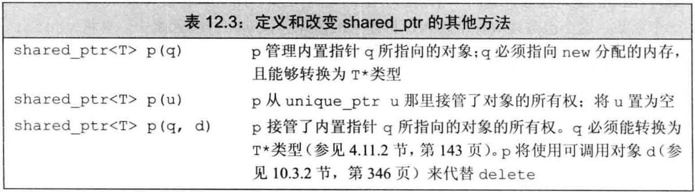
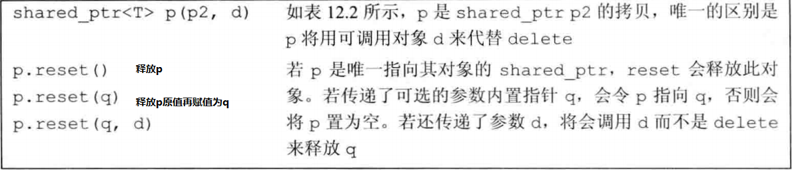
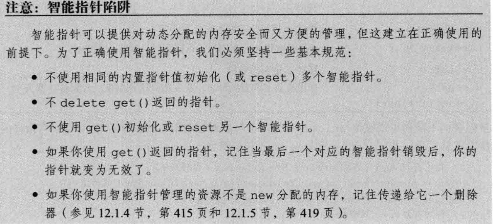

## 执行过程：

每个 shared_ptr 都有一个引用计数；当使用该指针初始化另外一个指针时，或将他作为一个参数传给一个函数时，再或者将其作为函数的返回值是会递增其计数；其中任意管指针销毁时会递减计数，例如局部的指针离开作用域 ; 一旦计数器为 0（最后一个指针被销毁）,就会自动释放其管理的对象

## 析构函数：

与构造函数相反，析构函数负责在销毁一个对象时做一些操作，通常用于释放一个对象占用的内存；销毁一个 shared 就是通过析构函数完成的，销毁时计数递减，如果为 0 就释放其内存

## memory 头文件

在判断语句中直接使用一个智能指针，效果就是检测他是否为空:空为 false
shared_ptr 共享指针；允许多个指针指向同一个对象
如果将 shared_ptr 放入了一个容器中，之后不需要全部元素，只使用其中一部分，记得用 erase 删除不再需要的元素

unique_ptr 独占指针；一个对象一个指针，只能使用直接初始化，无法拷贝，他销毁对象也销毁

weak_ptr 伴随类，他是一种弱引用，指向 shared_ptr 所管理的对象

智能指针默认使用 delete 来释放动态内存，但是智能指针也能绑定其他类型的资源指针上，所以可以手动更改 delete 这个默认操作，定义自己的释放操作

get()
此子函数返回智能指针管理对象的内置指针； 永远不要用 get 初始化另一个智能指针或赋值，只有在确定代码不会 delete 的情况，才使用 get

定义和改变 shared_ptr

p.reset(new int(123)) P 指向一个新的对象

指针使用规范

