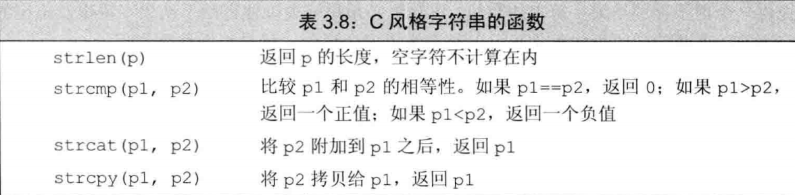
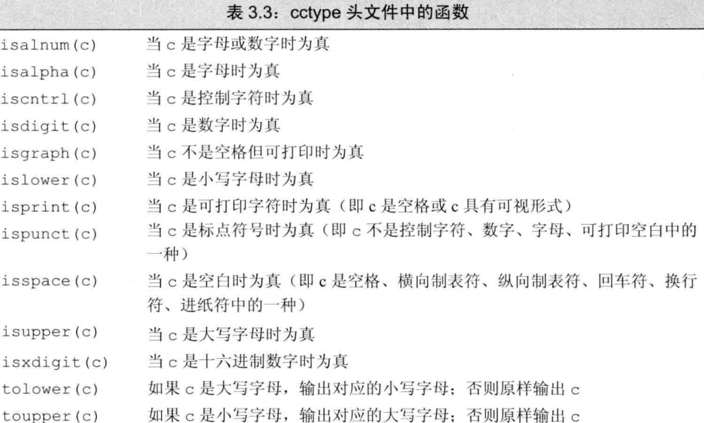

.h .hpp .hxx 都是头文件 标准库不带后缀
为了与 C 兼容，又保留 C++特性 C 标准库 name.h 在 c++定义为以 c 开头文件名 cname,名字也都在命名空间 std,也是为了区分哪些是从 C 继承的（当然也可以用 C 的标准.h）
标准库：
iostream 标准输入输出
string
stdexcept
initializer_list
继承 C：
cstddef ——与机器相关的类型 size_t、ptrdiff_t
cstddef
cstring 字符串工具 由于 C 对字符串的操作都是调用了指针，一些 C++的字符串操作 C 必须得用函数实现，但是 C 函数使用风险很大的——P 109

cctype 字符工具

标准函数库：
char toupper(char) 返回大写字符

---

使用指针比数组下标快（编译器可能已经做了优化）

控制台输出函数返回值：
windows echo %ERR 〇 RLEVEL%
linux echo $?

struct、class}后面要加;不然可能会把紧跟的单词作为声明类型

debug 模式可通过汇编嵌入修改 常量

命名规范
标识符要能体现实际含义
变量名一般使用小写字母开头，如 index
自定义类名一般以大写字母开头
多单词情况：每个单词首字母大写，如果下划线分割的单词其他单词全小写

自定义标识符不能连续两个下划线，也不能下划线紧接着大写字母，函数体外也不能下划线开头
