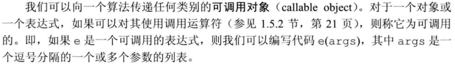

lambda 其实就是一个未命名的函数，对一个变量用 lambda 赋值时，其实是调用一次 lambda 函数

[捕获列表]（参数列表）-> 返回类型 { 表达式 }
捕获一个他所在函数中的一个局部变量，空捕获列表表明此 lambda 不使用他所在函数中的任何局部变量

当以引用捕获一个变量时，必须保证 lambda 执行时变量是存在的；一个函数返回值是 包涵引用的 lambda 表达式时 这个引用可能是失效的——尽量避免捕获指针和引用

隐式捕获，&指定以引用方式捕获，=以副本方式捕获；也可以指定某一个值以隐式之外的另一种方式捕获

=方式捕获一个变量时，创建了一个 lambda 同名局部变量，所以修改该变量不会影响 lambda 局部变量，普通参数是调用时拷贝，lambda 是创建时拷贝

空捕获列表通常可以用函数来代替，多次使用同样的 lambda 应该使用函数

在参数列表后加上 mutable 将声明一个可变 Lambda 表达式，捕获的值将可以修改，但只是修改副本，如果需要修改原值需要使用引用捕获
