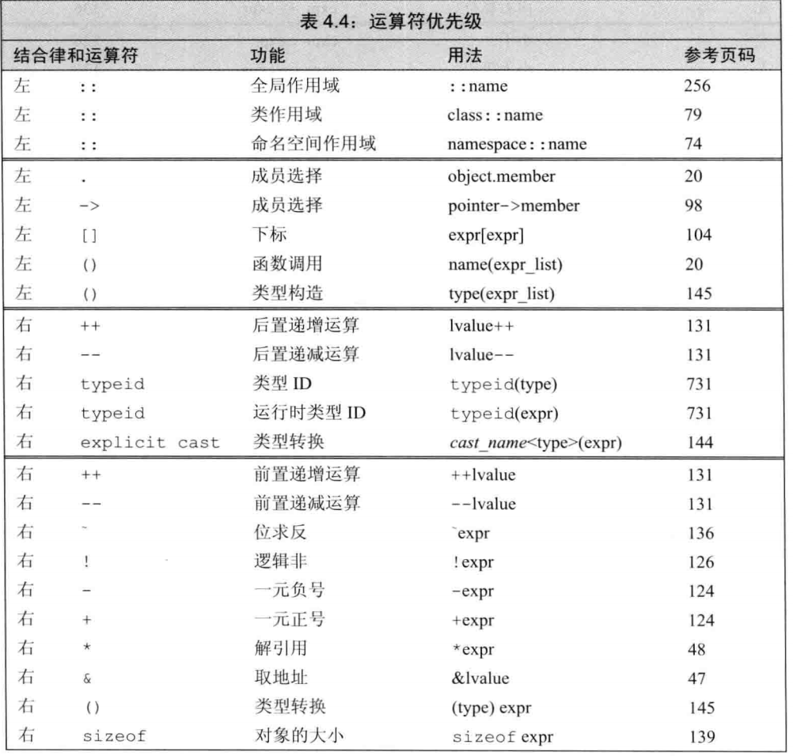
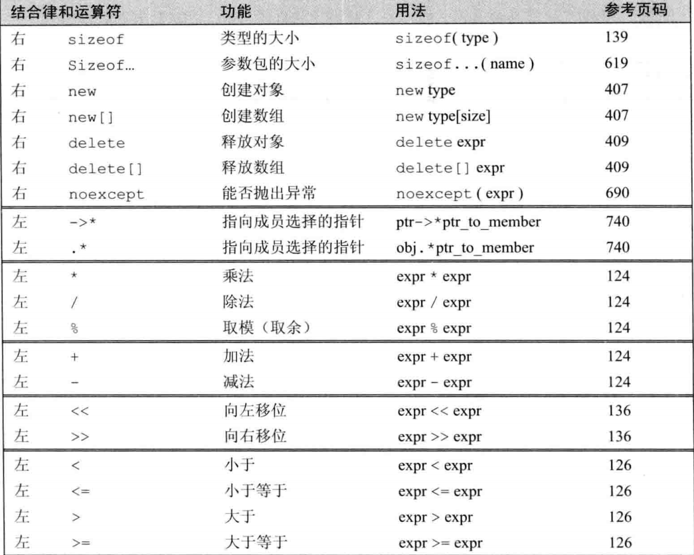
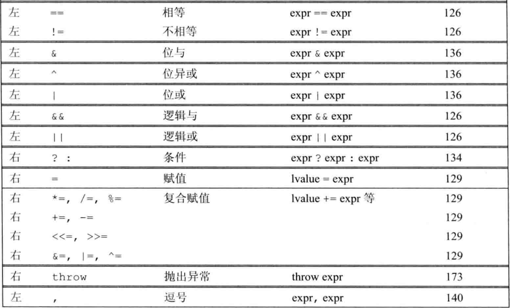

cin 标准输入
cout 标准输出
cerr 标准错误输出
clong 一般性输出
产生 EOF:
windows Ctrl + Z, Enter
Mac,linux Ctrl + D

算术表达式从内到外>++(可能响式子优先级)>内右到左
++ 前置效率高于后置(后置会产生原始值副本)

作用域运算符 ::
左侧是一个类型，右侧可以直接使用左侧作用域的数据对象

IO 运算符：
<< 输出运算符，在标准输出上打印消息；左侧必须是一个 ostream 对象，右侧要输出的值
<< 输入运算符，接受 istream 对象
endl 结束输入流，并且把输入缓冲区的内容刷到设备中（清空输入缓冲区）
——
——由于和 IO 运算符与移位重载，他比关系运算符优先级高，所以使用关系运算符要加括号
——
移位运算符：
负数移位可能会改变符号位，不建议用于负数
<< 右侧值不能为负而且值也不能超过对象长度

sizeof：右结合律 size_t

    1.

sizeof (type) 2. sizeof 表达式

不实际计算求运算对象的值，所以就算是解引无效指针也是安全的 1.返回对象所占的字节数 1.返回表达式结果的类型所占的字节数
对于数组 返回整个数组所占字节

++高于\*

