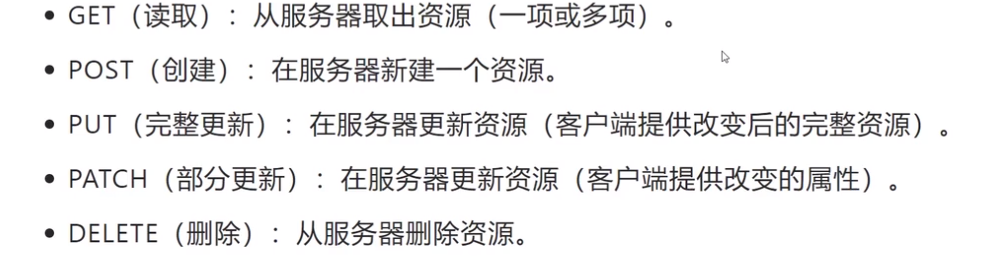

处理 Http 协议的后端开发框架，本身极简，通过继承插件方式来扩展功能

```js
const express = require("express");
const app = express();

{
  res: Request,
  req: Response,
}
```

## 常见插件

- body-parser: 解析 Http Body
- compression: 压缩响应的数据 Response
- cookie-parser: 解析 Cookie
- cors: 处理跨域请求
- express-session: 处理 Session
- morgan: 日志记录

## Request

继承自 Nodejs 原生请求对象 `Class http.IncomingMessage`，基于它做了些扩展

> req.body 为什么是 undefined：

req.body 是通过 body-parser 插件实现的(据说已经集成到 Express 了)，它会根据请求头 Content-Type 来解析请求体，然后挂载到 req.body 上；通过 app.use() 注册，这样就可以在 req.body 上获取到请求体了，比如：

- `app.use(express.json())` 将`application/json`请求体解析为 JSON 格式, 并且挂载到 `req.body` 上
- app.use(express.urlencoded()) 将`application/x-www-form-urlencoded`请求体解析为对象, 并且挂载到 `req.body` 上
- app.use(express.static()) 托管静态资源文件

## Response

继承自 Nodejs 原生响应对象 `Class http.ServerResponse`，基于它做了些扩展

Express 的扩展主要是支持链式调用

一些常用方法：

- res.statusCode = 200 设置响应状态码
- res.status(200) 设置响应状态码, -- express
- res.setHeader() 设置响应头
- res.cookie() 设置 Cookie
- res.json() 会自动设置响应头 Content-Type: application/json
- res.send() 发送响应，支持复杂结构，会根据参数类型自动设置响应头和响应数据类型 -- express 4.x
- res.write() 发送响应，可以多次调用
- res.end() 发送响应, 并且结束响应

[中间件](./Express-middleware.md)

## promisify

将 Nodejs 原生的异步方法转换为 Promise 方法；就是那种函数签名没有使用 async, 通过回调函数的方式来处理异步的函数

```js
const fs = require("fs");
const { promisify } = require("util");

const readFile = promisify(fs.readFile);

await readFile("./package.json");
```


