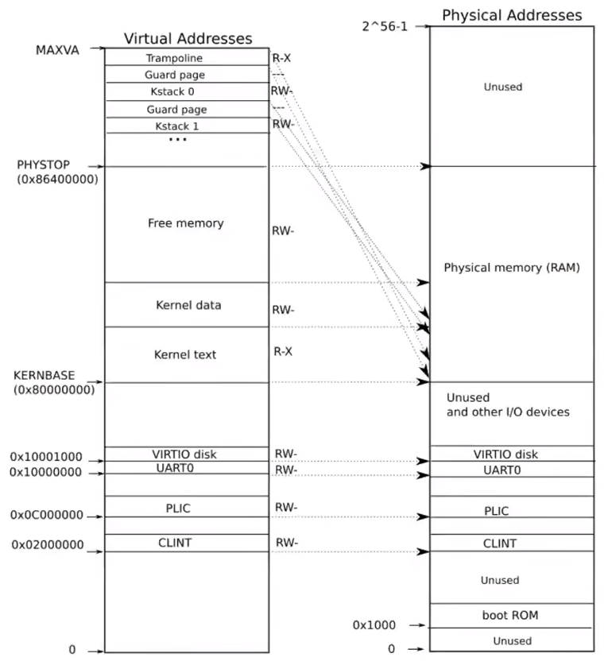

## 硬件资源

0x0~0x8000 被映射到各种 IO 设备，0x8000 开始往后属于 RAM

## RAM

早期内存中有一种，类似小丑扔球的方式；不停的刷新电容保持数据

## 壳

Shell 是一个“把用户指令翻译成系统调用”的编程语言

## 操作系统做核心的工作

- 系统调用：提供特权级别的 API；每隔一段时间，操作系统负责强制中断一个进程切换到其他进程
- 进程任务调度：保存进程执行现场的状态，寄存器、内存。然后回复另一个进程状态;TSS、EFLANGS、TCB
- 资源分配：对硬件资源的管理，分配、回收、授权。。

##### QA: 如果没有操作系统会怎么样

- 也许一个进程会一直霸占 CPU，其他程序无法得到运行；
- 进程失去隔离性，对内存任意写入访问，破坏其他进程
- 没有防御性，几乎无法的应对恶意程序

## 内核

- 宏内核：操作系统内核代码全部在特权级模式运行（riscv 监督者模式）；高集成，bug 可能造成很大危害，也更容易产生 BUG，性能更好
- 微内核：操作系统内核代码在用户模式下运行；模块化，各部件需要 IPC 通信，性能略差，但 bug 带来的危害更小

## 强隔离性&多任务

现代 CPU 基本支持用户模式、内核模式，以及虚拟内存，以支持在 CPU 上运行`多任务`

> 内核模式

特权级指令，页表寄存器、状态寄存器、TSS、EFLANGS

> 用户模式

只能运行非特权级指令，如果尝试运行特权级指令，会让操作系统获得控制权，系统可以结束掉异常程序;

用户只能通过系统调用(syscall)执行特权指令，实际上用户不需要使用特权指令，只需要内核 API 的某个功能

> 虚拟内存

page table 页表：将虚拟地址映射到物理地址

每个进程都有属于自己的页表，可以访问任何位置，对于进程来说，页表就是他的全世界
提供了强大的内存隔离性

##### QA: 操作系统内核如何从用户程序夺回控制权

时间分片，内核给硬件设置一个定时器，每个一段时间强行打断用户程序，回到内核；
控制权一旦回到内核，内核可以结束恶意程序，或者调度其他用户程序运行

> TCB 可信任计算基础

## 内存

> 字节序
> 现在操作系统大多都是小端序（本地字节序），计算机网络使用大端序（网络字节序）

- 小端字节序：地址 0 为最低有效字节位
- 大端字节序：地址 0 为最高有效字节位

例：一个十六进制数：11223344h,在小端序存放顺序就是 44332211，显然低位的 44 放在内存低地址

## 内存布局

xv6 的虚拟内存和物理内存的映射:
为了简单使用了恒等对齐的方式，

## 打断 CPU 三种方式

- 系统调用，syscall
- 异常，exception
- 中断，interrupt；来自各种硬件 IO 信号，例如硬盘读写完成信号，键盘按下信号, 时钟

统称`trap`

# 库

musl libc 一个更轻量级的 C 库，更适合嵌入式系统；没有 glibc 历史包袱
