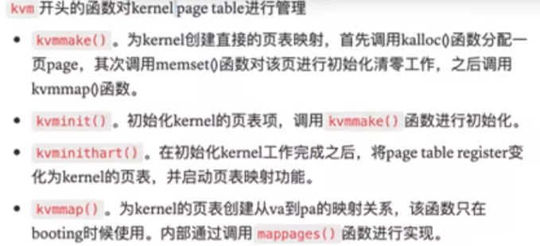

## MMU

现代处理器大多都有一个叫内存管理单元(Memory Management Unit)的硬件，负责将虚拟地址转换成物

内存被分割成若干个页，内存管理单元配合操作系统维护了一个叫页表的东西

## Page 页表

几乎所有处理器的`页`都规定为 4096(4kb)，页在物理内存中是连续的，内存分片的最小单位

## 虚拟地址 Virtual address

27 位虚拟地址,又叫做索引, 12 位偏移, 寻址能力为 512GB

偏移量：2^12 为 4kb,刚好一页大小

索引部分又被分为 3 部分(9bit 寻址能力，512)，对应 3 级目录，每级目录存放 512 个 PTE；这么做是为了节省空间，避免分配完整的页表(2^27), 现实中这是绝大多数时候不需要的
GPD->PD->PT，一层层找下去, 最后一层找到物理地址(56bit，44bitPPN 加 12bit 偏移)

如果 3 级目录任意不存在，引发缺页异常

## PTE

PTE: 占 64 位，高 10 位保留
中间 44 位，保存的是 PPN, 即物理地址索引(基地址)

后 10 个标志位：
0 位: Valid, 告诉 MMU 这个 PTE 是否有效
1 位: Read, 可读
2 位: Write, 可写
3 位: Executable, 允许执行
4 位: User, 用户权限下可以访问页面
...
9 位

## Satp 寄存器

一个页被使用时，将页表页物理地址写入 Satp，之后页表访问都会用这个地址

一旦被设置页表将启用， MMU 开始工作，所有的地址都被视为虚拟地址。整个世界都从真实变为虚拟！

每个 CPU Core 都有自己的 Satp

## TLB 部件

页表缓存器，缓存最近使用的 PTE，页表切换时操作系统有义务维护 TLB, 防止 MMU 使用了过时的 TLB
刷新 TLB 指令为: sfence.vma

## 物理地址 Physical address

寻址能力为 2^56, 实际上很多开发板没有支持这么大的寻址能力
44 位索引:12 位偏移

ps: 物理内存大于虚拟内存，虚拟内存耗尽(页表满)，但是物理内存中是还有可用空间的

ps2: 64 位只开放 56 位，可能是设计师认为更省电吧！实际上 56 位的寻址能力已经足以满足我们所有应用了

=====================================================================

# 核心数据结构&方法

`walk()`: 通过 virtual address(VA) 查 PTE
`walkaddr()`: 通过 virtual address 查 physical address(PA)
`mappage()`: 创建 VA 到 PA 映射，也就是创建 PTE
`freewalk()`: 递归的释放页表
`PTE2PA`: PTE 转 PA
`*pagetable_t`: 指向根页表 Global
`kalloc()`: 分配 4KB 内存

User Management:

`uvmalloc`: 主要就是分配 PTE 和相应的物理内存

Kernel Management:

`kvmmap()`: 做一些 PA-VA 映射关系，例如 IO 设备串口映射；只在 booting 阶段使用

## 一些常亮值

PHYSTOP: 128MB，进程最大可用空间；这是一个假设的值，实际上应该通过硬件信息来计算

## 进入虚拟内存模式

`kvminithart()` 这个函数设置了 satp,然后刷新了 TLB
