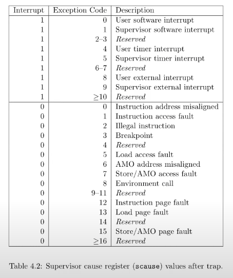

Tarp: 系统调用 syscall，异常 exception，中断 interrupt；是这三种事件的统称

syscall：执行各种内核权限的任务
exception：处理所有用户空间的异常行为，甚至将其杀死
interrupt：响应各种外围设备 IO

## 重要的寄存器：

为了安全不能依赖于 32 User reg，_内核不能信任用户空间的任意东西_，所以 Trap 时需要专有 reg

- STVEC: 内核启动时在这里写下 trap 处理程序的入口地址, 每当调用 ecall，它被赋值给 PC
- SEPC: 当 trap 发生时，RISC-V 会将程序计数器(PC)保存在这里。sret（从 trap 中返回）指令将 sepc 复制到 PC 中。内核可以写 sepc 来控制 sret 的返回到哪里。
- SCAUSE: RISC -V 在这里放了一个[编号](#scause-编号说明)，包含了 trap 发生的原因。
- SSCRATCH: 内核在这里放置了一个值，在 trap 处理程序开始时可以方便地使用。硬件自动写入，ecall(8)
- SSTATUS: SIE 位控制设备中断是否被启用，如果内核清除 SIE，RISC-V 将推迟设备中断，直到内核设置 SIE。SPP 控制了 sret 返回到什么模式，U(0) or S(1)。
- STVAL: 保存了触发 page fault 的页虚拟地址

User 模式是不能使用的；matching 下处理的 trap，有一组等效的控制寄存器；xv6 只在定时器中断的特殊情况下使用它们。

多核芯片上的每个 CPU 都有自己的一组这些寄存器，而且在任何时候都可能有多个 CPU 在处理一个 trap。

> STVEC: Supervisor Trap Vector Base Address Register
> SEPC: Supervisor Exception Program Counter
> SCAUSE: 系统调用(8),(1),_(2),_(4)

## 执行步骤(时器中断特殊)：

> 1. 如果该 trap 是设备中断，且 sstatus SIE 位为 0，则不执行以下任何操作。
> 2. 通过清除 SIE 来禁用中断。
> 3. 复制 pc 到 sepc
> 4. 将当前模式（U 或 S）保存在 sstatus 的 SPP 位。
> 5. 在 scause 设置该次 trap 的原因。
> 6. 将模式转换为特权态。
> 7. 将 stvec 复制到 pc。
> 8. 从新的 pc 开始执行，就是 trap 处理程序。

## trap 处理程序必要的工作

> 1. 切换为 S mode
> 2. 保存 PC 寄存器到 SEPC 寄存器
> 3. 通过把 STVEC 赋值给 PC, jmp to in trampoline(蹦床，意指 U 和 S 模式切换的中间代码)
> 4. 保存 32 个用户寄存器，恢复使用
> 5. 将 Stack Reg 指向内核空间；后续 trap 处理函数需要使用
> 6. 切换 STAP 寄存器，让他指向 Kernel Page Table(从 UPT 切换过来)，需要进入到内核处理函数

**ecall** 指令，每当调用 ecall 将自动完成操作前 3 步,

其他工作需要我们自己(trampoline)完成：4,5,6; 参考`trampoline.S uservec`

首先从 SSCRATCH 得到，trapframe page 地址，然后保存用户寄存器(4)，5，6;
最后跳入到`usertrap()`函数，所有 User mode 下的 Trap 入口

usertrap 一系列操作，例如对应的系统 调用。之后进入 usertrapret，关闭 CPU 中断，这里不允许再被打断，处理完后进入 userret,相当于一系列`trampoline`你操作，回复用户进程线程，`sert`

**sret** 根据 SSTATUS SPP 切换到指定模式，重新打开中断，复制 SEPC 到 pc

## trapframe page

proc.h 中 `struct trapframe`；内核启动后首次进入用户空间，这个 page 的虚拟地址被放到了 SSCRATCH 寄存器
trap 专用的页，User Page Table 中有这个页的映射；

```c
  // 部分寄存器
  /*   0 */ uint64 kernel_satp;   // kernel page table
  /*   8 */ uint64 kernel_sp;     // top of process's kernel stack
  /*  16 */ uint64 kernel_trap;   // usertrap()
  /*  24 */ uint64 epc;           // saved user program counter
  /*  32 */ uint64 kernel_hartid; // saved kernel tp
  // ...还有各种寄存器，40开始，对应了trampoline.S uservec函数存放用户寄存器的顺序
```

===

## SCAUSE 编号说明



## S mode 的权利

除了读写以 Trap 系列的寄存器，它还可以使用 PTE_U 标志位为 0 的 PTE

S model 能力也是非常有限的,任然需要通过 Page Table，受限于当前的虚拟地址， PTE_U = 1 页无法访问的
