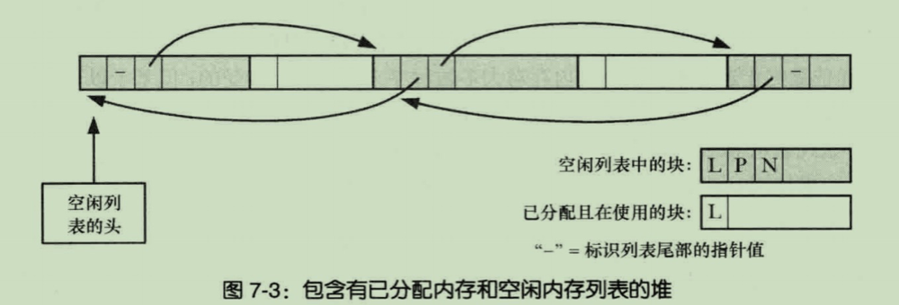

# 堆
指一段长度可变的连续虚拟内存,在未初始化程序段的末尾处.通常将堆的边界称为**program break**
在提升(增加内存分配)了program break位置之后,就可以对这段内存进行访问了;
对堆的分配并不是立即分配的,只是在虚拟内存中分配,而是在首次进行访问这段新内存是才真正分配物理页

---

# 调整program break
C语言中分配内存最常用 malloc函数簇,该簇是基于 brk()、sbrk()系统调用的,这两个调用在实际应用中不是那么易用,一般很少直接使用; --在Linux中sbrk基于brk实现的,所以调用 sbrk也就是相当于调用了brk

# brk() sbrk()
```c
int brk(void *end_data_segment)
```
brk会将 program break移动到end_data_segment指定的位置,实际上是以页为单位,移动到最后一个分配页的边界处
移动位置时如果小于 program break的初始值,可能会引发不可预知的错误;例如当访问已不存部分,会引发分段内存访问错误

```c
void *sbrk(inptr_t increment)
```
在原 program break位置增加 increment大小的空间,如果调用成功返回**新增加内存的起始地址指针**,也就是分配之前的program break地址
* inptr_t:整形类型

`sbrk(0)`返回当前program break地址指针

---

# 分配内存malloc() 和 释放内存free()
malloc簇比原生系统调用brk()、sbrk()具有更多的优势:
  * 属于C语言标准的一部分
  * 更易于在多线程中使用
  * 接口更简单,允许分配小块内存
  * 可以随时释放内存块,这些块被维护在一张内存表中,可以循环分配使用这些内存块

### malloc()
malloc返回的内存总是字节对齐的,通常是8字节或者16字节边界对齐
```c
void *malloc(size_t size)
```
  * size:  在堆上分配 size字节大小内存空间
  * 返回值: 返回指向新分配指向内存起始地址的指针,这段内存是未初始化的; SUSv3规定malloc(0)可以返回NULL或者一小块可以被free释放的内存,Linux采用后者
  * 返回错误:当 malloc无法分配内存时返回NULL,虽然这种可能性很小,但是都应该对 malloc的返回值进行错误检查

### free()
用于释放 malloc函数簇中某一函数获取的内存
```c
void free(void* ptr)
```
  * ptr: 释放ptr指向的内存空间,如果是一个空指针则说明也不做,这并不是错误;注意:使用释放后的 ptr,后果是不可预计的

free一般并不会降低 program break,他将内存块添加到空闲内存列表,之后malloc函数可以继续使用,原因:
  * 经常被释放的内存经常是位于堆中一段内存,所以降低program break是不可能的
  * 因为内存重复利用,最大限度减少了 sbrk()系统调用来增加或减少对 program break位置移动
仅当**顶部空间**有**足够大**的空间时 free才会调用sbrk()来对program break进行降低,这个足够大是由 malloc函数所设置的

*进程终止时,通过malloc函数簇分配的内存都自动被返给系统,程序运行期间**需要持续使用**的空间可以利用这自动释放机制;调用 free来释放反而占用CPU资源*

### malloc/free的实现
malloc:
  * 他首先扫描free释放的空闲列表,找到满足要求的内存块
  * 如果内存块大于要求的容会对该块进行分割,剩余留在空闲列表
  * 当空闲内存不满足要求,则会调用sbrk(),通常都会比要求的内存多,以页大小倍数进行增加program break

free:
  * malloc在分配内存时,实际上会在内存块起始位置额外分配几个字节(**长度字节块**)来记录这段内存的大小,返回的地址位于这长度字节块后面
  * free在将内存释放时也就是从这几个字节得知内存块大小的
  * 当free将内存存入空闲列表时,会在紧跟长度字节块后面增加,指向前一个内存空闲块和后一个空闲内存块的双向链表指针
<details>
<summary >malloc管理的堆,分配和未分配内存块图</summary>


</details>


### calloc
`void *calloc(size_t count,size_t size)`
 * count: 指定分配的对象数量
 * size: 指定对象的大小
 * calloc会将分配的内存初始化为0

### realloc
`void *realloc(void *ptr, size_t size)`
 * ptr为需要调整大小内存块的指针
 * size为需要调整的大小的期望值
 * 通常返回成功应该用返回的指针地址替换之前的指针地址
realloc优先使用紧接着 ptr指向内存块后连续的内存;
如果连续的内存无法满足要求,则会将当前的内存块数据复制到一块较大的新内存块,而且返回新的指针,这样做其实很耗费CPU资源
很重要的一点,在复制到新的内存块后,指向之前内存块中任意地址的指针都将失效

### alloca
`void *alloca(size_t size)`
 * 通过增加栈帧的大小堆栈上分配,在栈帧上进行扩展,只需要修改栈帧指针即可
 * alloca分配的内存不需要也不应该使用 free来释放,自然也不需要维护在空闲内存块列表
优点:
 * 具有比 malloc分配快速的更快;
 * 随着栈帧移除自动释放,就是在调用 malloc函数的返回时释放

### memaign 起始地址要与2的整数次幂边界对齐

