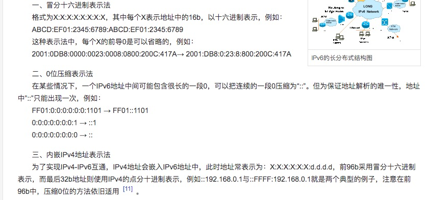

配置网卡/etc/sysconfig/network-scripts/ifcfg-\*
ifcfg-lo #该配置文件代表 localhost

ifcfg-\*
NAME=lan 　# 配置名称
DEVICE=em1 　#　网卡接口名称
ONBOOT=yes 　# 开机自动启动网络
IPV6INIT=yes 　　# 启用 IPV6
BOOTPROTO=static # 分别代表自动获取 IP 和固定 IP
IPADDR=192.168.0.101 # 设置 ip 地址
GATEWAY=192.168.0.1 # 设置网关
DNS1=8.8.8.8 # 首选 DNS
DNS2=144.144.144.0 # 备选 DNS
查看网卡信息[UUID,名称,类型]：nmcli con show

激活或关闭网卡:
ifup 配置名称 # 启用网卡
ifdown 配置名称 # 关闭网卡

重启/停止/查看网络服务
service network start # 启动网络服务
service network stop # 停止网络服务
service network restart # 重启网络服务
service network status # 查看网络服务状态
nmcli dev status # 检查受网络管理器管理的网络接口

常用命令:
ifconfig ＃　在一些发行版中是无效；安装：install net-tools
ifconfig 配置名称 192.168.0.10 １ #　配置临时 IP

ip 命令：
ip link show # 显示网络接口信息
ip link set eth0 up # 启用网卡
ip link set eth0 down # 关闭网卡
ip link set eth0 promisc on # 开启网卡的混合模式
ip link set eth0 promisc offi # 关闭网卡的混个模式
ip link set eth0 txqueuelen 1200 # 设置网卡队列长度
ip link set eth0 mtu 1400 # 设置网卡最大传输单元
ip addr show # 显示网卡 IP 信息
ip addr add 192.168.0.1/24 dev eth0 # 设置 eth0 网卡 IP 地址 192.168.0.1
ip addr del 192.168.0.1/24 dev eth0 # 删除 eth0 网卡 IP 地址
ip route list # 查看路由信息
ip route add 192.168.4.0/24 via 192.168.0.254 dev eth0 # 设置 192.168.4.0 网段的网关为 192.168.0.254,数据走 eth0 接口
ip route add default via 192.168.0.254 dev eth0 # 设置默认网关为 192.168.0.254
ip route del 192.168.4.0/24 # 删除 192.168.4.0 网段的网关
ip route del default # 删除默认路由

IPV6

