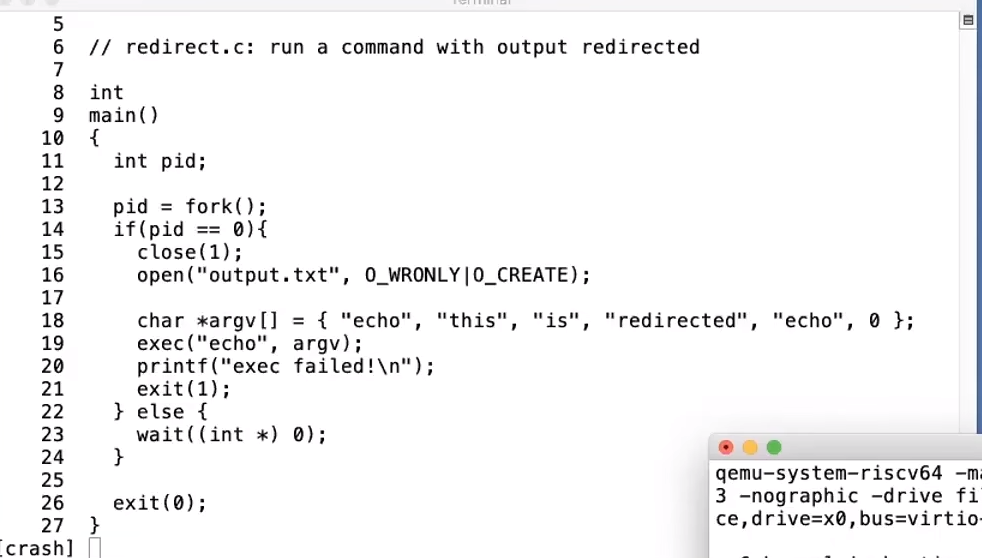

## exec

如果调用成功，不会再返回调用进程

失败返回-1；

## wait

如果没有子进程直接调用`wait`，只会得到-1

## open

- 子进程如果要打印数据，但是不想再终端输出打印内容，可以`close(1)`
  

## kill

实际上它并不会立即杀死一个进程，而是把那个进程状态设置为 killed，等待何时的时机那个进程会自己结束(exit 调用)

因为那个进程可能在执行一些文件访问或者持有一些锁等，会给其他进程造成麻烦的操作，所以还需要那个进程完成一些清理工作，然后自己结束运行
