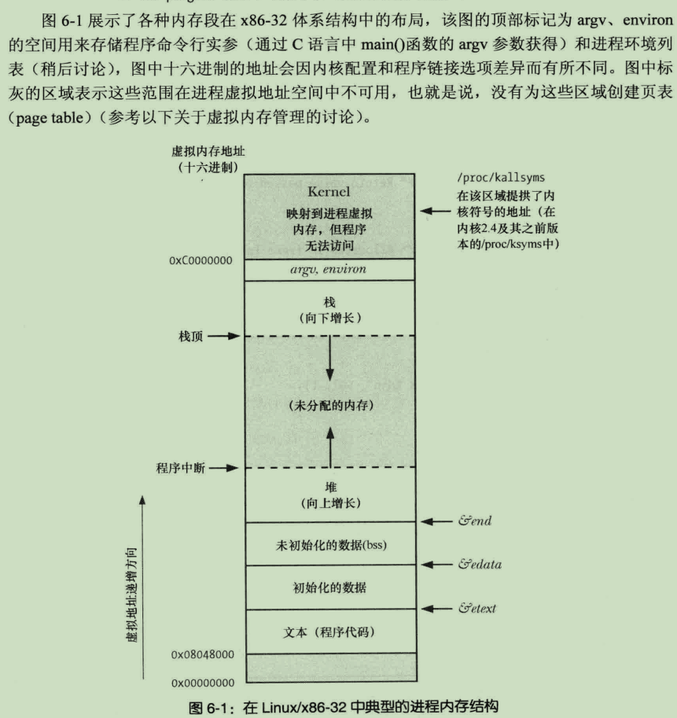

**程序**是指如何在运行时创建一个进程，熟称源代码

# 进程

是指是一个可执行程序的实例

Linix 内核限制进程号最大为 32767，不过现在的新版本内核都允许修改/proc/sys/kernel/pid_max 来调整上限
32 位平台允许 pid_max 最大值为 32768,64 位平台为 2^22(约 400 万)

# 获取进程号

getpid()获取当前程序 ID，gitppid()获取父进程 ID
当父进程被终止，子进程则变成‘孤儿’，被 init(进程号 1)进程收养

# 进程布局

一个进程在内存中由多个部分(段)组成

- 代码段：只读的防止被修改，共享的同一程序的多个进程可以执行同一份代码段
- 初始化数据段：包含了显示初始化的全局变量、静态变量，程序加载时从文件中读取的
- 未初始化数据段(bss)：包含了未显示初始化的全局变量、静态变量，程序加载时所有内存被初始化为 0
  _初始/未初始化数据段,将他们分开的原因是为了节省磁盘空间，没有必要为未初始化的变量分配空间_
- 栈：先进后出，可伸缩的段
- 堆：运行时可以进行分配的一块内存区域
  size 命令可显示可执行程序的代码段、数据段、初始/未初始化数据段的大小

### 不成文规定

大多数 unix、linux 环境中 C 语言有个三个全局符号：

- etext：文本段
- edata：初始化数据段
- end：非初始化数据段
  他们都保存了对应段后尾字节地址

linux_x86-32进程内存结构

# 发生内存共享的情况

- 运行同一程序的多个进程
- 使用 shmget()和 mmap()系统调用请求共享内存区，达到通信目的

# 命令行参数

命令行中的参数是由 shell 解析后传递给 main 函数的
C 家族语言中 main 函数的 argv 在一个进程的内存顶部

破坏移植性方式获取命令行参数：

- 读取/proc/PID/cmdline 文件获取当前程序的命令行参数
- GNU C 提供全局变量 program_invocation_name 获取改程序的完整路径名；program_invocation_short_name 不包含目录的文件名

# 环境变量

printenv 命令用于输出当前环境列表(`name=value`)
echo $name 输出一个变量的值

### environ

`#include <stdlib.h>`
当启动一个 C 语言程序时，环境变量列表将赋值给 `char **environ`全局变量
main 函数的第三个参数具有和 environ 相同的值

### getenv 通过环境变量名获取值

`getenv(char *name)`

### putenv 添加或修改境变量获取值

`putenv(char *str)`
str 的格式应为：`name-vaule` 格式
添加或替换 environ 中 name 环境变量
返回值为非 0，并不是-1
注意：如果后续继续对 str 指针进行操作会影响环境中的值
glib 对该函数的扩展：如果 str 不包含`=`则会删除与 str 同名的变量

### setenv 比 putnv 更好的添加方法

`int setenv(const char *name, const char *value, int overwrite)`
后续对 name 和 value 进行操作都不会有任何影响，因为该函数会将字符串复制到分配一块新的缓冲区,这块缓冲区通常无法手动释放，一直存在至进行结束
如果 name 已存在则不添加

### unsetenv 移除环境变量

`int unsetenv(const char *name)`

### clearenv 清除整个环境

`int clearenv()`
environ = NULL
虽然这一函数被广泛使用，但 SUSv3 标准更支持使用获取环境变量后逐一循环调用 unsetenv()来移除

正常情况下是不应该直接对返回地址进行操作来修改值的

## 内核模式

linux 有一个叫/proc 的文件系统，它允许用户模式访问内核模式的数据；/proc 文件系统将很多内核数据结构的内容转换成，用户程序可读的文本文件的层次结构

/sys 文件系统，它输出关于系统总线和设备的信息
