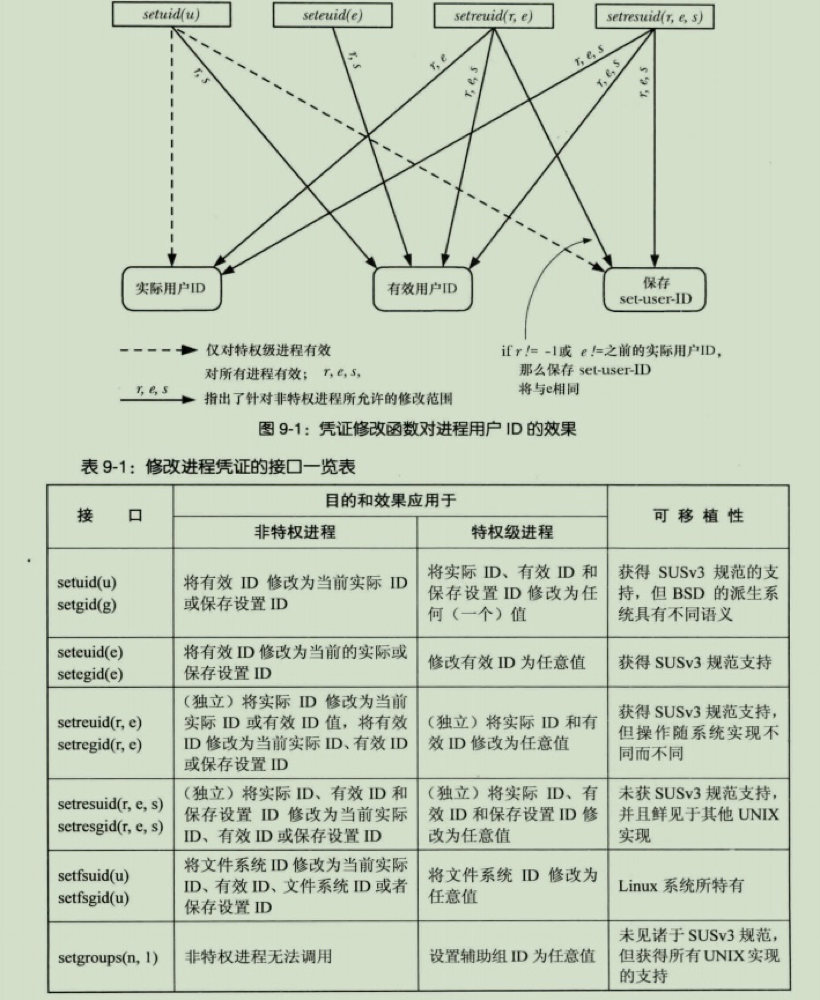

## 进程凭证

每个进程都有进程凭证,它由这些 ID 组成:

- 实际用户 ID、实际组 ID
- 有效用户 ID、有效组 ID
- 保存用户 ID、保存组 ID
- 辅助组 ID(附加组的 ID)
- 文件系统用户 ID、文件系统组 ID(Linux 特有,是历史原因所遗留,现在的程序不要使用)

### 实际 ID

登录时 shell 从/etc/passwd 文件中读取,第三个(用户 ID)和第四个字段(组 ID),作为进程的实际 ID 凭证
创建新进程时,字进程会继承这些 ID

### 有效 ID

通常有效 ID 和实际 ID 是相等的;某些系统调用会使其改变,运行 set-user-ID、set-group-ID 程序也会对其改变

- 内核会根据有效 ID 来决定一个进程是否能向另一个进程发送信号
- 当进行某些系统调用,访问某些系统资源时,将结合有效 ID、辅助 ID 来决定授予该进程的访问权限

#### Set-(U/G)ID 程序

_ps:_
_set-user-ID、set-group-ID 简称:set-id_
_--注意 set-id 权限位对 shell 脚本无效_

```sh
chmod u+s progName
chmod g+s progName
```

- 设置了 set-id 权限位的程序,通常来用标识可执行文件权限位 x 会被设置为 s 标识
- 该程序会将进程的有效 ID 设置为可执行文件的 ID(属主);
- 以属主的权限运行,使进程获取常规情况下所不具有的权限
- 一个属主为 root 的程序设置 set-user-ID 权限位,进程运行时会取得超级用户权限,将可以访问特权级系统资源
- 当程序中使用了特权级系统调用,必须将其设置为 set-id 程序,才可以给 root 以外的用户使用

##### Linux 系统中常用的 set-user-ID 程序:

1.  password
2.  mount
3.  su

##### Linux 系统中常用的 set-group-ID 程序:

1.  wall:用于向 tty 组管辖的所有终端写入一条消息

### 保存 ID

此 ID 是被用来和 set-id 结合使用的,设计意图在于增加编程时安全

- 当一个 set-id 程序开始运行时,保存 ID 就会被设置为有效 ID 相同;用于之后,将有效 ID 在 实际 ID 和保存 ID 之间切换
- set-id 程序运行期间,仅在需要有效(属主)ID 权限进行操作时才进行切换,操作完成后将切换回实际 ID

### 辅助 ID

进程的附加组 ID 标识,登录时从组文件获取,创建新进程时会继承这些 ID
在访问特定权限资源时和有效 ID 相结合决定其访问权限

---

## 获取和修改实际/有效 ID

#### 获取:

这些调用总是会成功的

```c
  #include <unistd.h>

  uid_t getuid(void);   //获取实际用户ID
  uid_t gegid(void);    //获取实际组ID
  uid_t geteuid(void);  //获取有效用户ID
  uid_t getegid(void);  //获取有效组ID
```

#### 修改:

以给定的 uid 参数值来修改调用进程的有效用户 ID、实际 ID、保存 ID

**_方法一:_**

```c
  #include <unistd.h>

  int setuid(uid_t uid);
  int setgid(gid_t uid);
```

非特权级:

- 非特权级进程当调用 setuid 时,仅能将有效用户 ID 修改为实际 ID 或保存 ID
- 非特权用户仅在执行 set-user-ID 程序时,setuid 调用才有意义,因为执行普通程序三个 ID 都是相同的
- 可移植性问题:派生自 BSD 的系统,还会修改实际、有效和保存 ID(改为实际或有效 ID)

特权级:

- 当特权进程调用 setuid 传递非 0 值时,三个 ID 都将被置为传递的这个值;需要注意,一旦特权进程修改了其 ID,他将丢失他所有的特权,也无法再使用 setuid 将有效 ID 改回 0
- 在使用 setgid 时,可以对组 ID 进任意修改,对组的 ID 修改并不会引起进程特权的丢失(是否拥有特权是由用户 ID 决定的)

**_方法二:_**

```c
  #include <unistd.h>

  int seteuid(uid_t euid)
  int setegid(gid_t egid)
```

非特权级:

- 除了可移植性问题,和 setuid、setgid 等效,仅能将有效用户 ID 修改为实际 ID 或保存 ID

特权级:

- 能够将有效 ID 修改为任意值,如果将有效用户 ID 改为非 0 值,则失去特权,但是可以通过实际 ID 或保存 ID 来恢复特权

---

## 独立修改实际/有效 ID

```c
  #include <unistd.h>

  int setreuid(uid_t ruid, uid_t euid)
  int setrguid(gid_t rgid, gid_t egid)
```

- 第一个参数:新的实际 ID
- 第儿个参数:新的有效 ID
- 如果只需要修改其中一个,传递给另一个参数-1 即可

非特权级:

- 只能将实际 ID 修改为有效 ID,或实际 ID(无变化)
- 只能将有效 ID 修改为实际 ID、保存 ID,或有效 ID(无变化)

特权级:

- 能将实际 ID 和有效 ID 设置为任意值

同一下任意操作还会将保存 ID 设置为有效 ID:

1. 传递给 ruid 值不为-1
2. 传递给 euid 值不等于当前实际 ID
   `setreid(getuid,getuid())`这个调用会永久放弃特权,无法恢复;因为保存 ID 也被修改为了当前 ID

## 获取和修改辅助组 ID

获取当前进程辅助组 ID 的集合,SUSv3 规范还允许包含有效组 ID,保存在给定数组中

```c
  #include <unstid.h>

  int getgroups(int gidsetsize, gid_t grouplist[]);
```

- gidsetsize: 给定数组的长度,如果组 ID 数量大于这个值返回错误号 EINVAL,为避免错误发生可将长度设置为 NGROUPS_MAX + 1(<limits.h>头文件)
- grouplist: 给定数组的地址
- 返回值: 置于 grouplist 组 ID 的数量 --技巧:getgroups(0,grouplist),不经修改 grouplist,就可以获得数组的数量

#### 获取 NGROUPS_MAX 值

- sysconf(\_SC_NGROUPS_MAX)
- Linux 特有文件读取/proc/sys/kernel/ngroups_max

### 特权级进程修改辅助组

未纳入 SUSv3 标准,但所有 Unix 都有实现支持

```c
  #include <grp.h>

  int setgroups(size_t gidsetsize, const gid_t *grouplist)
  int initgroups(const char *user, gid_t group)
```

setgroups 用`grouplist`指定的集合替换进程的辅助组 ID

initgroups:

- user: 登录用户的账号
- group: 用于追加到辅助组的 ID 集合

<details>
<summary>凭证修改函数对进程用户ID的影响(图)</summary>



</details>
