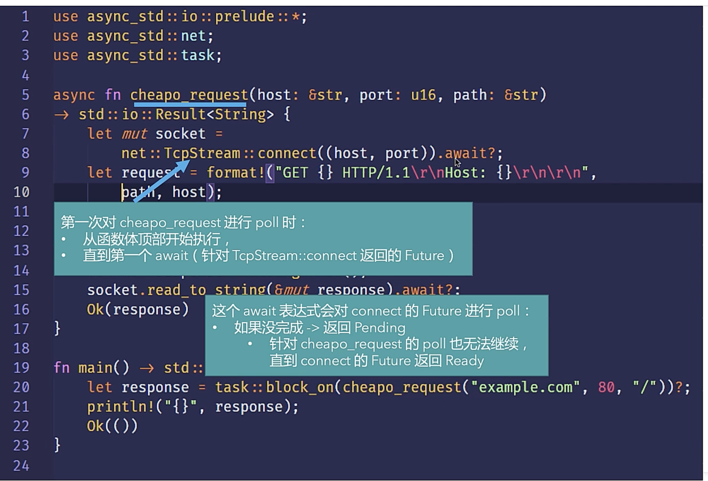

## Rust 中异步运行时 create

原生只支持了 Future Trait 和 async/await 关键字, 第三方库只要实现了特这个 Trait 即可，常见的有

- tokio
- async-create
- futures-create

# 底层机制

## block_on 和 join! 和 await

- block_on 会阻塞当前线程，
- join! 指定多个任务，所有任务完成时，解除阻塞
- select 等待某个分支执行完成；如果所有任务都是完成的会执行 complete 分支
- .await 则是运行线程执行其他任务

## Futures Trait

实现了这个 Trait 的含义是，目前还不可用，未来某个时刻会变得可用

Futures 是惰性的，除非驱动(Poll)他执行，否则他就啥也不干

## Executor

负责驱动任务执行(Poll)

任务队列(Channel), Context，worker 的掌管者，创建线程执行这些任务

ps: 底层利用了 OS 平台的一些机制来做通知唤醒任务，例如 linux epoll

async 讲解和官方示例：
[https://www.bilibili.com/video/BV1Ki4y1C7gj?p=4]
[https://rust-lang.github.io/async-book/02_execution/04_executor.html]

# 应用层面

## 语法糖 async/await

await 驱动 async(Futures)任务执行

async 任务一层套着一层，必须里层的 async 完成，外层的才可以继续

> async fn 是什么？
> async 的工作，可以想象一个被打包的函数，打包函数上下文，有点像闭包的感觉，
> Executor 执行这个函数，遇到.await，又开始驱动下一个任务执行，最终得到了 Ready，一层层返回
> 协程的概念，Pending 时，函数保存上下文（形参，局部变量。。），下一次 Poll,恢复上下文，继续上次的位置执行；

[https://www.bilibili.com/video/BV1Ki4y1C7gj?p=6&vd_source=29954a52608497ee1a304ca105f8cb17]

async{ ...block }, 打包这个块中的代码，上下文

## async fn 与 Send、Sync

async 打包的函数可能被 Executor 转移到其他线程去执行，所以必须是 Send、Sync 的

## Pin 与 Unpin

实现了!Unpin 的对象用于不会被移动; 用得不多，需要再看

[https://www.bilibili.com/video/BV1Ki4y1C7gj?p=7]

## Stream Trait

`futures::stream:TryStreamExt` crate 提供了一些实用方法

用于迭代异步任务，所以也叫作异步任务迭代器

## 执行多个 Futures

join!、select！、Spawning

## Other

一些错误处理方案： [https://www.bilibili.com/video/BV1Ki4y1C7gj?p=11&vd_source=29954a52608497ee1a304ca105f8cb17]

tokio 机制讲解：[https://www.bilibili.com/video/BV16r4y187P4/?spm_id_from=333.999.0.0&vd_source=29954a52608497ee1a304ca105f8cb17]

自己实现的 Future [https://github.com/nullptr-z/balabala/blob/main/src/taskController.rs]
