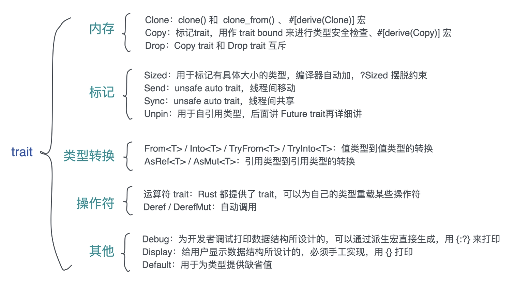

## 使用 Trait 的技巧

1. 一般而言，当 trait 接受某个形参 input，应该使用泛型参数，比如 Add<Rhs>；当它输出某个返参 output，那么应该使用关联类型，比如 Future、Stream、Iterator
2. input 如果是泛型的，在传参的时候，如果有多重不同的类型要使用这个方法，那么最好把它们放到一个枚举或者结构体中，不然会各自`静态生成`一份副本

### [trait 常用示例](https://blog.csdn.net/htyu_0203_39/article/details/109412983)

**trait 对行为延迟绑定**

## 孤儿规则：

> 当你为某类型实现某 trait 的时候 1.该类型或者 trait 至少有一个是在当前 crate 中定义的 2.你不能为第三方的类型已经实现的 trait，再次自定义实现 trait(不能重新实现)

## 空 Trait 定义

rust 编译器广泛用于给具体类型`打标签`，`验明正身`之用或者`归类`，不具有实际定义(不具备逻辑处理和返回结果)； 比如：Send、Sync、Copy、Sized 等等------详情可参考 std::marker::\*
通常还可以用于`泛型类型约束`，`参数类型约束`，

## Self 和 self

> 1.Self 代表当前的类型，比如 File 类型实现了 Write，那么实现过程中使用到的 Self 就指代 File。
> 2.self 在用作方法的第一个参数时，实际上是 self: Self 的简写，所以 &self 是 self: &Self, 而 &mut self 是 self: &mut Self。

## FromStr

是 Rust 标准库定义的 trait，实现它之后，就可以调用字符串的 parse() 泛型函数，将字符串转换成实现的相应格式。

## From/tryFrom

将目标类型转到本类型

## Into/TryInto

将本类型转换到目标类型

## Send

可以在跨线程时安全地转移，对象实例的所有权

## Sync

可以安全的在多线程共享变量，不会出现数据竞争

## Deref Trait

_所属: std::ops -- 可重载操作符_
该 Trait 对应**不可变借用的解引用操作符**, 可变版本: `DerefMut Trait`

- 解引用指针操作时,指向指针所指的对象

Deref 是为智能指针设计的，只应被智能指针类型实现。它会根据解引用规则自己动，不需要显式的调用.deref()，
通俗来讲就是方便,在直接用指针 `.`操作时可以直接调用指向对象方法和属性；或者 `*`解引用时，获取内部对象的值

## AsRef Trait

_所属:std::convert -- 拥有类型转换_
从 &T -> &U 的一种转换，并且是无**转换开销**的。可变版本: `AsMut Trait`

根据 Rust API Guidelines[9] 里的命名规范可以推理，以 as\_开头的方法,这种转换不能失败。
是用于一般的、轻量级的且不会失败的不同类型的引用之间的转换。例如 Vec -> slice

在使用过过程中与 [Deref](#deref-trait)相似,都能得到结构中的内部对象的引用,但`AsRef`需要显示调用`.as_ref()`

## Borrow Trait

任何类型 T 都实现了 Borrow Trait, &/&mut

#### Deref or AsRef or Borrow

Deref: 解引用的会后得到结构中的内部对象的借用
AsRef: 用于将一个类型转换另一个类型，且几乎没有开销的
Borrow: 得到内部对象的借用，暂时获得所有权，用于借用一个类型的值而不进行拷贝；实现 Borrow trait 的类型必须和被借用的类型是一致的（这也是和 AsRef 最大的区别）

## Cow

Cow 是一个枚举。有点类似于 Option，表示两种情况中的某一种。Cow 在这里就是表示 借用的和自有的，但只能出现其中的一种情况。

- Cow<T>能直接调用 T 对象的不可变方法，因为 Cow 这个枚举，实现了 Deref；
- 在需要修改 T 的时候，可以使用`.to_mut()`方法得到一个具有所有权的值的可变借用；
  1. 注意，调用 `.to_mut()`不一定会产生 Clone；
  1. 在已经具有所有权的情况下，调用 `.to_mut()`有效，但是不会产生新的 Clone；
  1. 多次调用 `.to_mut()`只会产生一次 Clone。
- 在需要修改 T 的时候，可以使用`.into_owned()`创建新的拥有所有权的对象，这个过程往往意味着内存拷贝并创建新对象；
  1. 如果之前 Cow 中的值是借用状态，调用此操作将执行 Clone；
  2. 本方法，参数是 self 类型，它会“消费”原先的那个类型实例，也就是说调用之后原先的类型实例的生命周期就截止了，在 Cow 上不能调用多次；

## Index

对结构提供通过索引访问功能的能力

## PartialEq, Eq 区别

PartialEq: 对比两个对象的值和类型是否相同
Eq: 不关心类型是否相同，只比较他们的值

