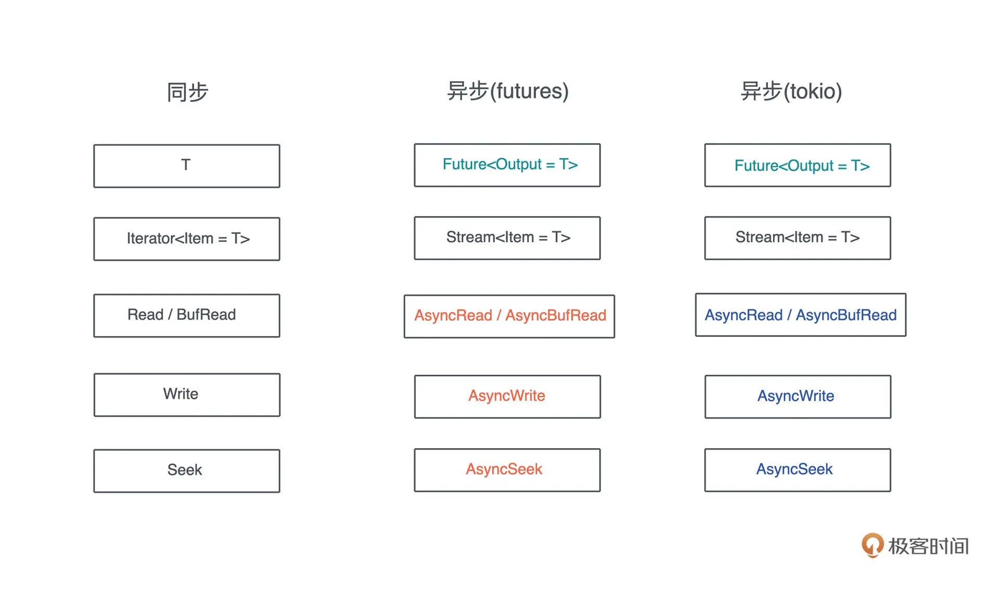

## Pin

在 Rust 中，Pin 类型用于保证对象的内存地址不会改变。这是必要的，因为一些对象（如 Future）可能会在多次 poll 调用之间保持自身的状态。如果对象的内存地址在这些调用之间发生变化，那么对象的状态也可能会被错误地访问或修改。

当你创建一个 Pin 对象时，你实际上在告诉 Rust，这个对象现在已经被 "钉住" 了，不能被移动。这样，Rust 编译器就会阻止任何可能移动这个对象的操作，从而确保对象的地址保持不变。

这里的 "移动" 是指改变对象在内存中的位置，而不是改变对象的所有权。例如，如果你将一个对象从一个 Vec 移动到另一个 Vec，或者你将一个对象作为函数参数传递，那么这个对象在内存中的位置可能会改变。

> 一些使用场景：
> Pin 类型通常与 Future 和异步编程一起使用，确保在异步执行期间，不会发生数据移动；
> 自引用结构体可能出现在需要在异步上下文中持久化的情况，Pin<Box<Self>>
> 以及其他需要保证对象地址不变的情况。

## Unpin

说明数据结构是可移动，而非锁定内存位置的

一般来说，为异步操作而创建的数据结构，如果使用了泛型参数，那么只要内部没有自引用数据，就应该实现 Unpin。
这会给别人在使用这些的代码时带来很多方便

## Stream Trait

可以自认为的把他叫做，异步迭代器，对应于同步环境下的 Iterator

不断地读`poll_next`取异步数据流中，直到数据源中没有数据为止。常用于从网络 Socket 读数据

Iterator .next 是可以确定会返回数据的
Stream .poll_next 是不确定的，因为 Stream 是异步的，可能需要等待一段时间才能返回数据。

无法和 for 循环 Stream 一起使用, 可以和命令式的 while let 和 next/try_next 函数可以以起使用

## Sink trait

常用于异步写入数据，例如将数据写入网络套接字。

向数据源中发送`start_send()`数据, 但 Send 的数据不知道什么时候准备好，去读.poll_read()是否准备好

## 异步 I/O 之 AsyncRead Trait/ AsyncWrite Trait

更为底层的异步读写, tokio/futures 右各自的定义

主要使用在文件处理、网络处理等场景，例如 file、TcpStream、TlsStream 都已经实现了它们，还有一些常用的 IO 库都实现了

也可以自己实现一个异步 IO 库，虽然绝大部分时候不需要：

```rs
impl AsyncRead for myFile
```

实现这个 Trait 即可使用, AsyncReadExt 提供的方法做异步读取

如果编译器抱怨一个泛型参数 “cannot be unpinned” ，一般来说，这个泛型参数需要加 Unpin 的约束。

## futures

提供一些基础异步编程抽象(Trait), 不过 tokio 也提供了不少和他类似的抽象

因为在 tokio 和 futures 库实现的早期，社区还没有形成比较统一的异步 IO trait，不同的接口背后也有各自不同的考虑，这种分裂的两大阵营；不过现在已经是 tokio 为主了

- [用于在两种结构间切换](https://docs.rs/tokio-util/0.6.9/tokio_util/compat/index.html)
