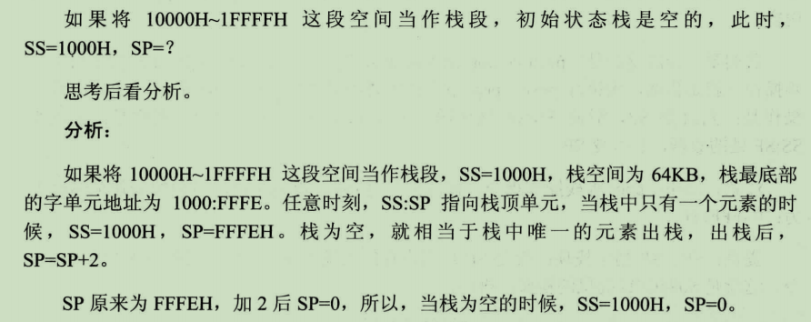

db 0 定义一个字节
dw 0 定义一个字
dd 0 定义一个双字

db 3 dup(0) 定义三个字节
db 3 dua('abc','ABC') 定义了 18 个字节

ss 被赋值后会对栈进行记录初始化,所以 sp 被 T 命令一起执行
cs=(ds+10H)\*16(实际效果就是 256 字节) 10H 是 PSP,DOS 使用 PSP 和被加载的程序进行通信

SS 应该被设置为 期望栈顶位置+2 ; 8086 单个寄存器(这里指 SP) 只能最多寻址 64KB(0~FFFF),所以 ;如果期望栈顶是 FFFFE 则 + 2= 0,而不是 20000

重点:栈指令只对 SP 操作 ,所以 SS 起到的作用仅仅是一个指针作用 ,他不存在内存中,所以不存在内存数据覆盖他的问题

## 汇编语言学习笔记（8）--数据处理的基本问题

1、只有“bx、si、di、 bp”四个寄存器可以用在[...]方括号中来进行内存单元的寻址;[立即数]会被编译为一个常数

2、这四个寄存器可以单个出现也可以以[by+zi]形式出现: y=x 或 p，z = s 或 d ，其他格式均为错误的。
3、当使用 bp 时，如果没有显性地给出段地址，则段地址默认在 ss 段寄存器中。

4、汇编语言中用三个概念来表达数据的位置：
立即数（idata）：
直接包含在机器指令中的【数据】（执行前在 CPU 的【指令缓冲器中】），在汇编指令中直接给出
寄存器
指令要处理的【数据】在【寄存器】中，在汇编指令中给出相应寄存器名 段地址和偏移地址
指令要处理的【数据】在【内存】中，段地址在某个段寄存器中，偏移地址通过[X]给出

5、当数据在内存中时，有多重寻址方式，一般都是在[…]里给出偏移地址，偏移地址可以是第 1 条所述四个寄存器中的单个的寄存器，也可以是这四个寄存器中的某个或某两个寄存器与立即数的组合。

6、指明要处理的数据的尺寸的方式：
(1).通过寄存器名称指明，如 al 代表数据为一个字节，ax 为两个字节
(2).用操作符 X ptr 指明 内存单元长度， X = word 或 byte
(3).push 指令只进行字操作

7、div 在汇编中为除法指令
除数有 8 位和 16 位两种，存放于寄存器或内存中，如果除数为 8 位，被除数在 AX 中，AL 存储除法操作的商，AH 存放余数；如果除数为 16 位，则被除数的低 16 位存在 AX 中，高 16 位存在 DX 中，商存在 AX 中，余数存在 DX 中。
8、db 定义【字节型】数据，dw 定义【字型】数据，dd 定义【双字型】数据
9、dup 操作符与 db、dd、dw 配合使用进行数据的重复

## 寻址方式总结

总是[SA].idata, [SA].idata[EA]的写法原因在于,idata 在程序运行中不可变的,很适合用表示在结构中的某个具有意义的位置
如果用高级语言来描述的话就是
对象(SA).成员变量(idata)
对象(SA).成员数组(idata)[下标(EA)]

