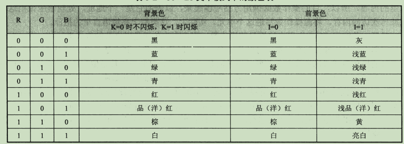
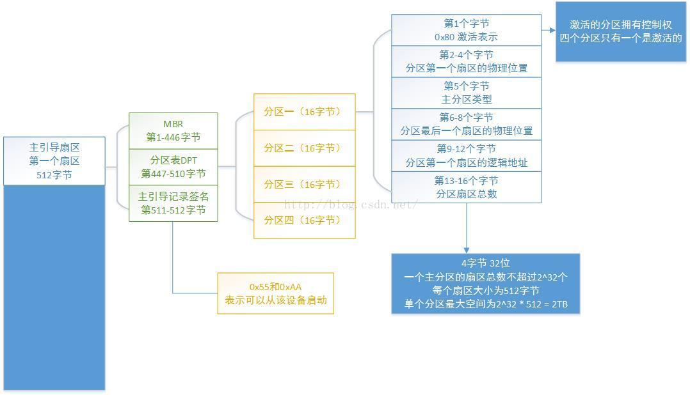

一台计算机加电以后,CPU 指向 FFFF0,这通常是一个跳转指令,指向主板 BOIS->
通常跳转去执行主板上烧录的 ROM 程序(BOIS，UEFI)进行自提),这段程序由多个中断例程组成;包含基础的 IO,实模式下可用->
基础硬件检测程序等;硬件检测通过后,BIOS 程序将硬盘（各个分区）第一个扇区（0 磁道 0 扇区）(主引导记录，分区表)加载到内存地址 7c00h->
PC 指针指向 7c00h,然后根据主引导记录启动操作系统,执行后操作权限交给操作系统->

任何通用的操作系统,都要提供一个为 shell 的外壳程序（GUI 也可以说是壳）,操作人员使用这个程序来操作计算机进行工作;
例如 DOS 系统的 shell 就是 command.com,linux 中的 cshell,bash 等
操作系统启动时先执行一些重要的初始化工作,然后运行 shell,屏幕就会输出一个等待输入的命令行->
当操作人员启动一个程序时,shell 程序将这个程序加载到内存,根据可执行文件描述信息设置入口(cs:ip ,汇编中的 end start),shell 暂停,操作权限由这个程序接管->
当这个程序运行结束时(执行返回程序:恢复 shell),shell 继续执行,shell 等待下一个指令 --------单任务系统 ,多任务系统的 shell 是创建一个子 shell 来加载其他程序的

cs 比 ds 大 10H 原因:
cs=(ds+10H)\*16(实际效果就是 256 字节) 这 256 字节是 PSP 程序,DOS 使用 PSP 和被加载的程序进行通信

ss 被赋值后会对栈进行记录初始化,所以 sp 被 T 命令一起执行

#### QA 可执行程序文件有哪些信息

除了源程序,还包含了相关描述信息:
程序入口位置,用于设置 cs:ip,一个程序还包含了数据部分,通常在主程序入口之前申明
程序有多大,占用多少内存空间
等...

========================================================
16 位实模式

DRAM 占据 640KB : 00000~9FFFF
ROM 占据顶端空间 64KB : F0000:FFFFF;
接着中间有一部分是显卡之类的外围设备
FFFF0 是 CPU 开机要执行的第一条指令(BIOS),是一个 16 字节的调转指令,通常说调转到 7c00

扇区,对于硬盘来说的最小单位 通常 63 个扇区一个磁道,每个扇区其实是部分包含了多个字节,每个扇区起始字节包含了自己所在的扇区号.磁道号.磁头号,有些时候还会有健康标志,以及替换这个扇区的地址

磁道在设计时为了减少移动磁头,通常以面柱形式运行

磁盘的第一个地址(引导扇区)通常是 0 面 0 道 1 扇区,这里就是系统引导程序

引导程序被挂载到 7c00,为什么是这个地址,问设计者去

访问硬盘
要访问硬盘至少要向硬盘控制器提供 4 个参数,磁头号,扇区号.磁道号.读写意图(IO),每次对硬盘读写至少操作一个扇区

访问显存
显存被映射到地址 b800 的起始地址,偏移地址从 0x0000~0xFFFF

KRGB - IRGB K:前景色 I:背景色

屏幕上黑色部分在显存是空格字符 ascii:0x20 配合 色彩 0x007

