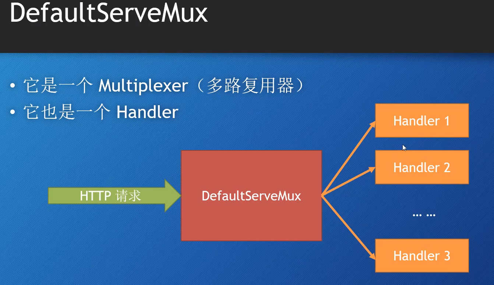

## Create Http Server

```go
func main() {
  http.HandleFunc("/", func(w http.ResponseWriter, r *http.Request) {
    w.Write([]byte("hello world"))
  })

  http.ListenAndServe("127.0.0.1:8989", nil)
  // 另一种等价方法方法，可配置性更强
  // server := http.Server{Addr: addr, Handler: nil}
  // server.ListenAndServe()

}

```



## Create TCP Server

```go
func (slf *Server) Start() {
  // listening
  listener := net.Listen("tcp", server_addr)
  // close listen socket。 函数退出后才会执行
  defer listener.Close()
  // accept
  for {
    connect:= listener.Accept()
    connect.Write([]byte("hello world"))
  }
}

// client
client,err := net.Dial("tcp", "host:port")
defer client.Close()
```

## Run

本地开发模式： go run .
