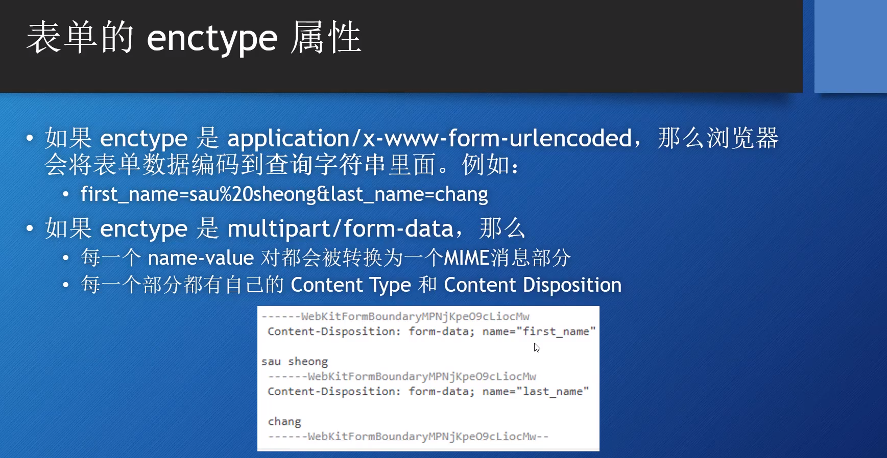

- package net/http
- package net/url
- 关键类型: Response、Request； Cookie、URL、User、User Agent
- 关键字段：Body、PostForm、MultipartForm、URL、Header

## Request Header

r.Header // 获取整个 map
r.Header["Accept-Encoding"] // 返回切片类型
r.Header.Get("Accept-Encoding") // 返回字符串

## Request Body

获取一个 request body，再原封不动发回去

```go
func post(w http.ResponseWriter, r *http.Request) {
  len := r.ContentLength
  body := make([]byte, len)
  r.Body.Read(body)
  fmt.Fprintln(w, string(body))
}
```

## Request Query

```go
func query(w http.ResponseWriter, r *http.Request) {
  // query原始字符串
  queryStr := r.URL.RawQuery
  fmt.Println("queryStr:", queryStr)
  // query 切片
  querySlice := r.URL.Query()
  fmt.Println("querySlice querySlice")
  // 获取name参数
  name := querySlice.Get("name")
  fmt.Println("name:", name)
}
```

## Request Form

enctype 默认 `application/x-www-form-unlencoded`
可选项目:

- `multipart/form-data`大数据量使用，例如文件；还经常配合 base64 使用
- html5 支持`text/plain`

Method: `get/post`

```go
// 解析 Request
r.ParseForm()
r.ParseMultipartForm()
// 获取 form 参数
r.Form            // 获取所有参数
r.PostForm        // 只获取表单部分数据，忽略Url参数
r.MultipartForm   // 获取`multipart/form-data`类型的数据
r.MultipartReader(r)  // 也用于处理multipart/form-data类型的请求，流式的读个读取
// 直接获取参数，不需要显示调用解析
r.FormValue("name") // 优先获取表单中的值，如果URL有同名参数
r.PostFormValue("name")

func form(w http.ResponseWriter, r *http.Request) {
  r.ParseForm()
  fmt.Println("fromData:", r.Form)
  fmt.Println("fromData:", r.PostForm)
  fmt.Println("name", r.FormValue("name"))
}

func formMultipart(w http.ResponseWriter, r *http.Request) {
  r.ParseMultipartForm(1024)
  fmt.Println("fromData:", r.MultipartForm)
}
```



## Upload File

`multipart/form-data`实际最常见的应用场景就是文件上传

```go
func upload(w http.ResponseWriter, r *http.Request) {
  // 方法一
  r.ParseMultipartForm(1024)
  fileHanler := r.MultipartForm.File["files"][0]
  file, err := fileHanler.Open()
  // 方法二
  // 如果只获取一个文件，这一行等同于上面三行
  file, _, err := r.FormFile("files")

  if err == nil {
    buf, err := io.ReadAll(file)
    if err == nil {
      fmt.Fprintln(w, string(buf))
    }
  }
}
```

## JSON Body

---

> 扩展知识

MIME（Multipurpose Internet Mail Extensions）： MIME 是一种互联网标准，它扩展了电子邮件标准，使其能够支持多媒体内容、非 ASCII 字符集和结构化文本。MIME 类型通常由两部分组成，如 "text/html"，其中第一部分表示主要的媒体类型，第二部分表示具体的子类型。

Multipart： Multipart 是 MIME 中的一种特殊类型，它允许将多个部分组合在一起，形成一个整体消息。这种消息类型通常用于发送包含多种媒体类型或多个文件的数据。Multipart 消息的边界（boundary）用于分隔各个部分。
