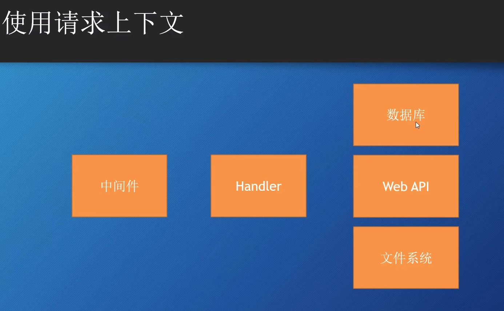

## Context

在整个请求服务链中各个环节，大家都可能需要知道的一些信息

只读的，如果需要修改需要拷贝副本

```go
type Context interface
  Deadline()  // 时效时间
  Done()      // 用于取消操作
  Err()       // 返回取消原因，如果有取消的话
  Value()     // 获取Context的一些信息

// 返回一个取消函数CancelFunc，调用这个函数会通知监听这个Context的自己Done了
func WithCancel()
// 设置超时时间，时间戳，返回一个取消函数CancelFunc
func WithDeadline()
// 设置一个超时区间，返回一个取消函数CancelFunc，
func WithTimeout()
// 接受一个Context覆盖原来的；对Context的修改实际上拷贝了一个新的
func WithValue()
```

## Timeout 示例

```go
type TimeoutMiddleware struct {
  Next http.Handler
}

func (tm TimeoutMiddleware) ServeHTTP(w http.ResponseWriter, r *http.Request) {
  if tm.Next == nil {
    tm.Next = http.DefaultServeMux
  }

  ctx := r.Context()                               // 获取当前Context
  ctx, _ = context.WithTimeout(ctx, 3*time.Second) // 修改，添加超时时间
  r.WithContext(ctx)                               // 新Context覆盖当前Context
  ch := make(chan struct{})                        // 创建一个接受信号的管道
  go func() {                                      // 处理下一个方法
    tm.Next.ServeHTTP(w, r) // 处理中
    ch <- struct{}{}        // 超时时间内完成了，发送信号；`struct{}`类型{}值
  }()
  select {
  case <-ch: // 正常实现完成
    return
  case <-ctx.Done(): // 超时了
    w.WriteHeader(http.StatusRequestTimeout)
  }
  // defer cancel()
  ctx.Done()
}

```
