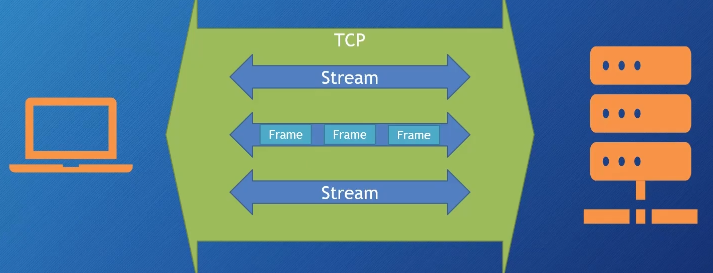
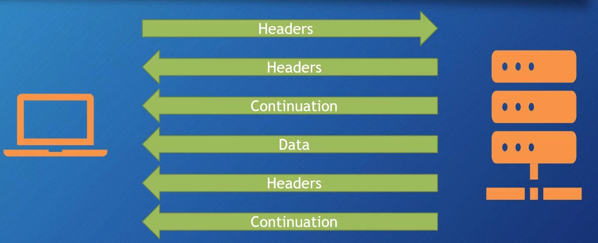
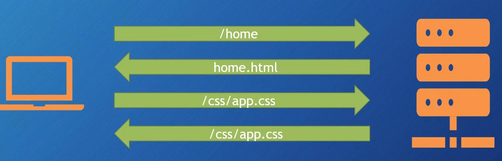

## HTTPS

在 HTTP 是不安全的，传输的数据很容易被读懂。所以在它之上套一层 TLS 协议加密，使得内容只有发送方、接受方放能理解，中间服务是无法解读的

## Crate Https Server

go 内置工具创建 HTTPS 会自动将 http 1.1 协议升级到 http2 2.0

```go
func main() {
  // 本地自签发的证书，浏览器会警告，是正常的，因为它无法验证
  addr := "127.0.0.1:8988"
  fmt.Print("Listening on https://", addr, "\n")
  http.ListenAndServeTLS(addr, "cert.pem", "key.pem", nil)
}
```

## Create Cert

生成自签发的证书，用于开发测试，生产环境需要使用 CA 签发的证书

```sh
go run /usr/share/go/src/crypto/tls/generate_cert.go -host localhost
```

## HTTP2

- 多路复用
- header 和 body 分离，header 只发送变化的部分,因为 header 的内容相对固定不变
- Header 压缩
- 默认安全,HTTPS
- Server Push 服务端开发者，可以主动预先发送一些客户端可能需要的资源

TPC Stream 由多个 Frame 组成


各种 Frame，每种类都不同的优化方法，例如压缩、复用


如果一个 html 文件里面还有其他静态资源，css js 等，就都要单独发请求去获取

