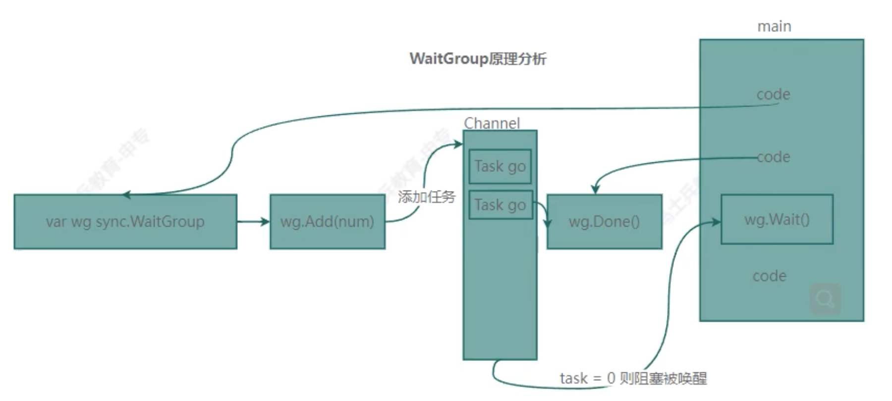

chan 内部数据结构是一个队列，被设计成是线程安全的

读时没有数据会发生阻塞，写入时没有可用缓冲区也会发生阻塞

对 nil 的 channel 读写都会导致阻塞

## channel 基本操作

```go
make(chan type)

channel <- value  // 向管道发送 value
<- channel        // 丢弃一个值
x := <- channel   // 接受一个值，保存到x
x,ok := <- channel// 检查channel是否已经关闭或者为空

len(channel)  // 长度
cap(channel)  // 缓冲区，注意这是缓冲区，满了是不会自动增长的

// 不常用，用于函数签名
ch_only_send := make(chan <- int, 1)     // 只写
ch_only_receive := make( <- chan int, 1)  // 只读
```

## 带缓冲 channel

```go
make(chan type, capacity) // 带缓冲的channel

c_buf := make(chan int, 2)
  go func() {
    c_buf <- 4
    c_buf <- 3
    c_buf <- 2
    c_buf <- 1           // 缓冲区满了会阻塞这里，当读取这个数字后，会退出程序
    fmt.Println("-> 10") // 因此这里不会被执行
  }()

  re := <-c_buf
  for {
    fmt.Println("c_buf:", len(c_buf), cap(c_buf))
    if re == 1 {
      break
    }
    re = <-c_buf
  }
```

## interface

interface{} 类型的管道，可以接受不同类的类型，注意从管道接受这样类的的时候，的需要断言成原来的类型才能使用

```go
func main() {
	ch := make(chan interface{}, 5)

	ch <- User{age: 22}
	age := (<-ch).(User).age  // 断言
	fmt.Println("age:", age)

	ch <- 1
	ch <- User{name: "my name"}
	ch <- "哈哈"
	close(ch) // 一定要关闭后才能 for。否则会阻塞
	for c := range ch {
		fmt.Println("c:", c)
	}
}
```

## 阻塞管道

关闭管道 `close(channel)`

```go
c_buf := make(chan int, 2) // 这里演示这个例子 2 很重要
  go func() {
    c_buf <- 2
    c_buf <- 1           // 缓冲区满了会阻塞这里；当主程序读取这个数字后，主程序会退出
    fmt.Println("-> 10") // 因此，这里不会打印,
    close(c_buf)
  }()

  fmt.Println("c_buf:", len(c_buf), cap(c_buf))
  for {
    if re, ok := <-c_buf; ok {
      fmt.Println("re:", re)
    } else {
      break
    }
  }
```

## Range

一直从管道中读数据,直到管道关闭，没有数据了就会阻塞在那里

```go
for val := range channel {
  fmt.Println("val:", val)
}
```

## select

监控多个 channel，直到某一个可读或写

```go
label:
for {
  select {
  // 可读取
  case <- c1:
    fmt.Println("<-c1:", <-c1)
    // 可写入
  case c2 <- 0:

  default:
    break label
  }
}
```

## 定时任务

内部就是一个写管道，指定时间后写数据

```go
func main() {
	// 定时任务，管道
	fmt.Println("now:", time.Now())
	sec := 3 * time.Second
	// 方式一
	fmt.Println("never:", <-time.After(sec)) // 3秒后执行
	// 方式二
	timer := time.NewTimer(sec)
	fmt.Println("never:", <-timer.C) // 3秒后执行
}
```

## 循环定时任务

```go
func main() {
	count := 3
	for {
		t := <-ticker.C
		fmt.Println("at:", t.Format("2006-01-02 03:04:05AM"))
		count--
		if count < 1 {
			break
		}
	}
}
```

事件机制实际上就是，`time.NewTimer(sec)`和`timer.Reset(sec)`实现的

## 等待任务，sync.WaitGroup

内部使用信号量唤醒等待，和`atomic`计数任务数量

- ADD 添加任务+
- Done 任务完成-
- Wait 阻塞任务，被信号量唤醒时，使用 SAW 判断计数器是否为 0，退出或继续阻塞

```go
func main() {
	var group sync.WaitGroup
	count := 3
	ticker := time.NewTicker(1 * time.Second)
	group.Add(1)
	go func() {
		defer group.Done()
		defer ticker.Stop()
		for {
			t := <-ticker.C
			fmt.Println("at:", t.Format("2006-01-02 03:04:05AM"))
			count--
			if count < 1 {
				break
			}
		}
	}()
	group.Wait()
}
```


