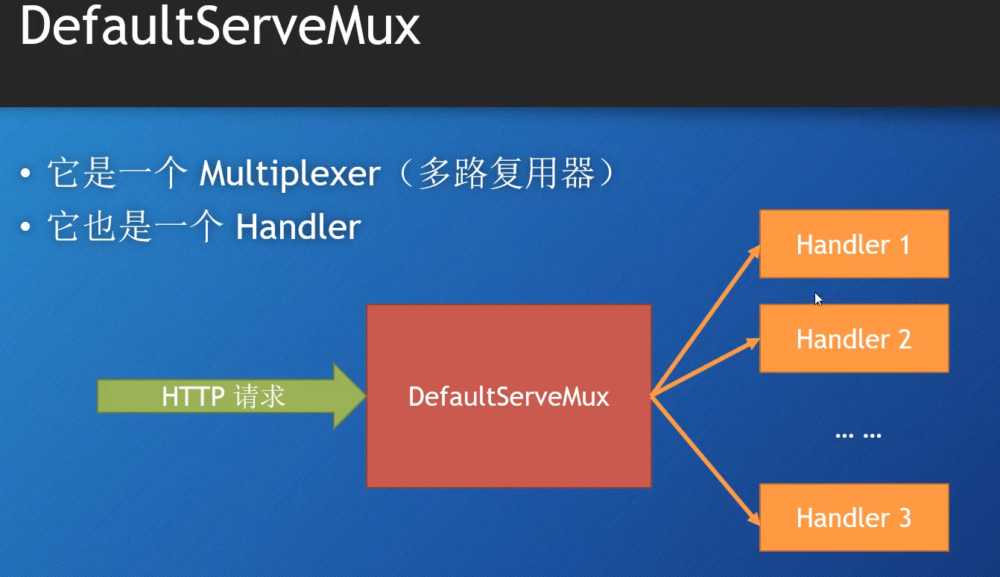

## Create Http Server

```go
func main() {
	http.HandleFunc("/", func(w http.ResponseWriter, r *http.Request) {
		w.Write([]byte("hello world"))
	})

	http.ListenAndServe("127.0.0.1:8989", nil)
	// 另一种等价方法方法，可配置性更强
	// server := http.Server{Addr: addr, Handler: nil}
	// server.ListenAndServe()

}

```



## Create TCP Server

```go
func (slf *Server) Start() {
	// listening
	listener := net.Listen("tcp", server_addr)
	// close listen socket。 函数退出后才会执行
	defer listener.Close()
	// accept
	for {
		connect:= listener.Accept()
    connect.Write([]byte("hello world"))
	}
}
```

## Run

本地开发模式： go run .
