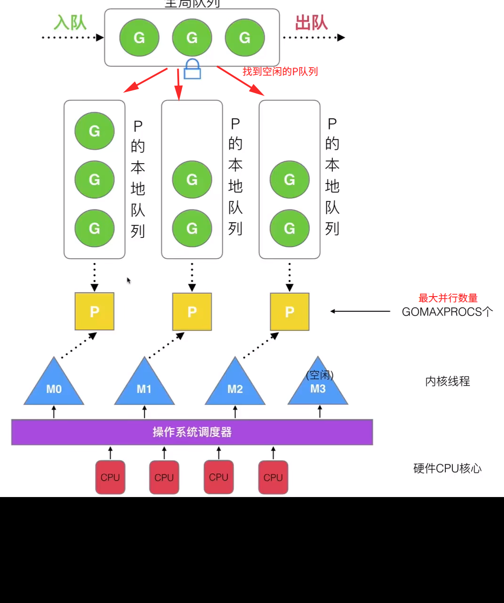

goroutine 实际上就是一种协程的实现方式；但是做得很高效

M:N 模型，M 协程，N 线程

## 优势

- 开销极小，几 KB
- 调度灵活，切换快速

## GMP

G:Goroutine, P:processor, M: thread

## 调度器策略

- 复用线程
- 利用并行
- 抢占式调度
- 全局 G 队列

##### 复用线程

work stealing 任务窃取,空闲 P 会从其他 P 那任务过来执行

hand off 当 P 有一个任务发生阻塞，重新创建一个线程，把 P 移动到新线程去执行

##### 利用并行

GOMAXPROCS 限定 P 的个数，线程 N 的数量

##### 抢占式调度

时间分片，到时间了切换到其他任务执行

##### 全局 G 队列

当一个 P 队列空闲时，优先从其他 P 窃取。如果没有窃取到任务，从全局队列中获取，注意，需要对全局队列上锁
