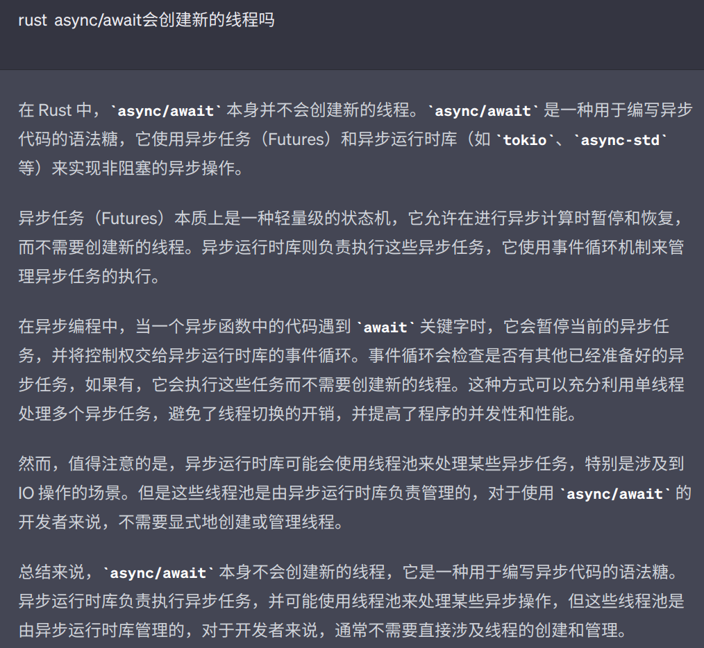

## 概述

并发不一定是异步的，而异步操作可以是并发的。并发和异步是实现多任务执行的方式

> 异步是指，一个任务可以分成多个子任务（小的块），他们不需要一直同步顺序执行，他们各自完成自己的任务，到某个时刻，将结果合并起来，完成整个任务。他们可以在单个 CPU 上，不同的时间片交替执行，也可以在多个 CPU 上并行执行。

> 并发是指，一个任务（代码段）被创建了多个实例或者说副本（完整的），分别执行，他们可以在单个 CPU 上，不同的时间片交替执行，也可以在多个 CPU 上*并行*执行。通常他们之间还需要通信，以完成整个任务。

## 实现异步的机制

事件循环，回调，协程，多线程，多进程，Promise, async/await, Generator/yield

## 异步管理机制，管理器

协程管理器，线程池，进程池

## 异步和并发的区别

可以看出异步和并发他们在使用上有很大重叠，但是他们的目的不同，异步是为了提高程序的执行效率，而并发是为了提供更多的服务

## 异步实现的机制

不同语言，通常一下几种方案：

- 事件循环
- 回调
- 信号/通知
- 中断

## 事件循环

事件循环的实现可以是基于操作系统提供的机制（如 epoll、kqueue 等）或者纯粹的用户空间实现
