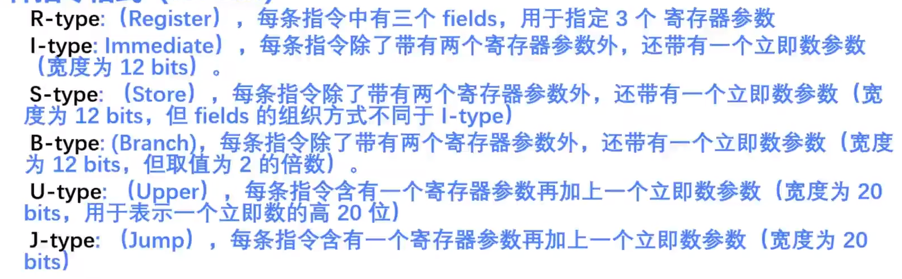
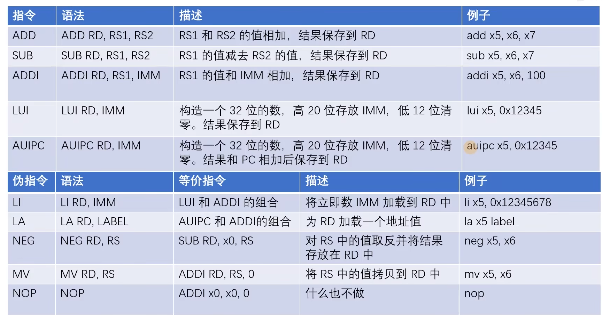
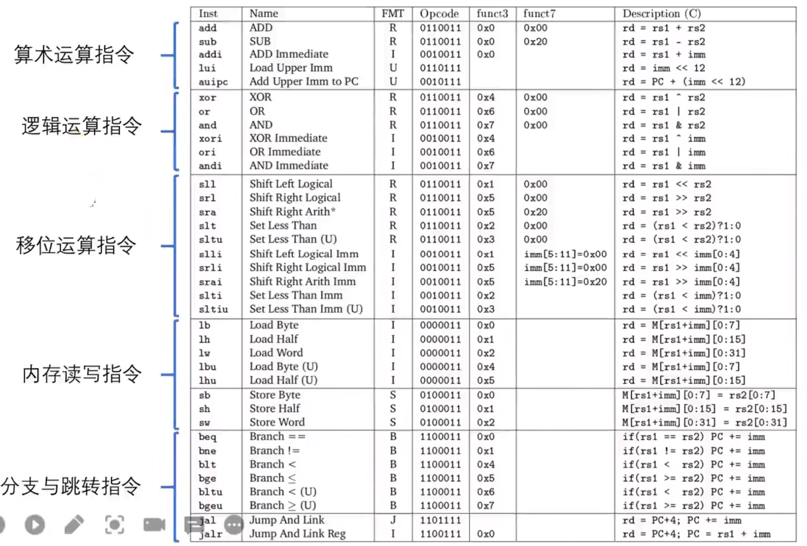
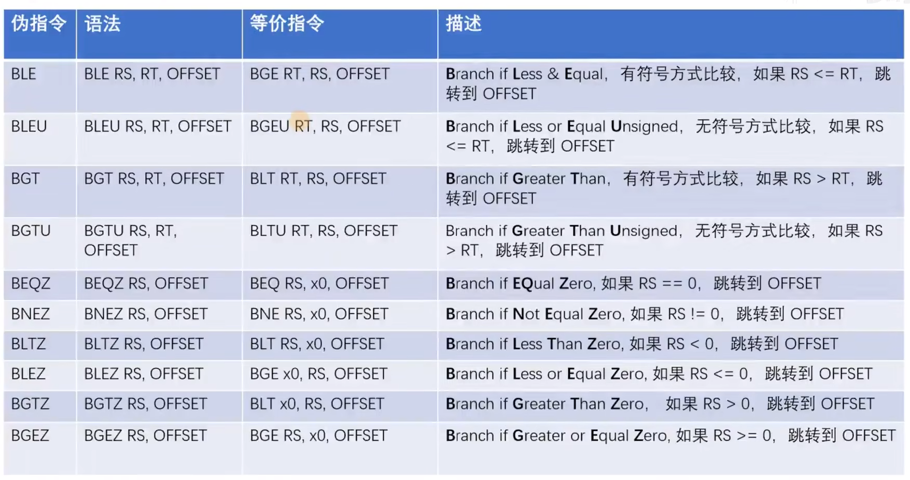
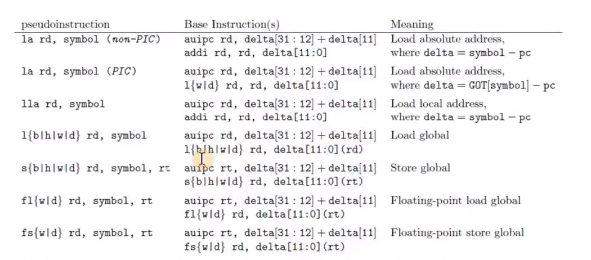
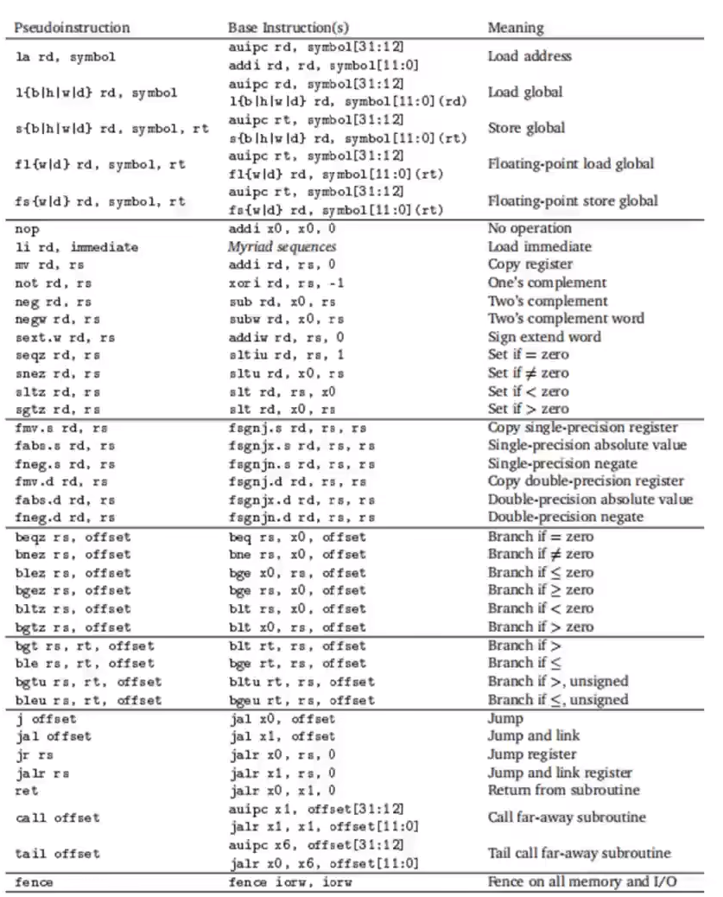

32 个通用寄存器，x0 ~ x31

RV32I: 基本整数指令集

Hart: 相当于一个最小的执行单元，理解成 CPU 即可

.global: 类似 C 语言的 extern

## PC

程序计数器，Program counter,指向下一条需要执行的指令

## CSR

Control Status Register

除了 32 个通用寄存器，模式(M/S)下都还有自己独有的 CSR

## 6 种指令格式

# 常用指令

每条指令 4 字节

## ADD&SUb

减去一个正数就是加他的相反数

Add: 加法指令

ADDI: 加一个立即数，最大值 2^12，最大知识-2^11 ~ 2^11 - 1；

LUI: 构造一个 32 位立即数，清 0 低 12 位,相当于<<12；一般不直接使用，使用
LI 伪指令做大的立即数计算（封装 ADDI + LUI）

AUIPC: 伪指令和 LUI 一样，但是他完成 LUI 操作后，还要加上 PC 寄存器的值；一般不直接使用，使用 LA 伪指令（封装 ADDI + MV），完成一些相对地址的运算

算数运算指令:

## 原子交换指令

amoswap.w.aq a5, a5, (a4)

## 伪指令

通常伪指令被翻译成多条汇编指令

NEG: 取反，等同于 sub rd, x0, rs
MV: 移动指令，等同于 addi rd,rs,0
NOP 空指令，占位指令 addi x0, x0, 0

## 内存读写指令

例子：`sw x5,40(x6)`，基于 x6 中的基地址+40imm 寻址

> Load: 读，LB/LBU(8bit)、LH/LHU(16bit)、LW(32bit),后面带 U 的版本可以理解为无符号扩展

> Store: 写，SB、SH、SW

## 条件分支跳转指令

Branch: 寻址范围+/-(2^10)，BEQ、BNE、BLT、BLTU、BGE、BGEU; U 后缀代表无符号

条件分支伪指令：

## 无条件跳转

jump and link,以 PC 寄存器为基地址跳转

`jal x1, label` 寻址范围+/-(2^21)，跳转到 label，将当前指令位置下一条指令的地址保存在 x1, 作为返回地址

jalr: `jalr x1, imm(x2)` 基于 x2 寄存器加上 12 位(imm) 立即数进行跳转，返回地址在 x1

J、JR 伪指令，无返回跳转，相当于用 x0 作为 jar 的返回地址寄存器，

call offset 远跳伪指令,由 auipc + jalr 封装
tail offset 与 call 一样，不过没有返回值

ret 返回伪指令，根据 x1 保存的地址返回调用位置

## 寄存器

x0: zero 读他总为 0，写时不生效
x1: ra, return address, 存放函数返回地址
x2: sp 栈指针
x5~x7 x28~x31: t0~t6, temporaries 临时寄存器，从一个函数返回后可能被改变
x8 x9 x18~x27: s0..s11，saved, 函数撰写者保证不改变这些寄存器，或者会负责恢复它们
x10~x17: a0~a17, 参数寄存器，用于高效传参，比使用栈(内存空间)快

常用指令：

一览：

