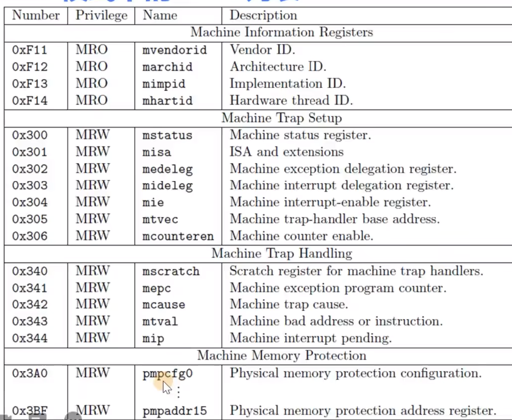
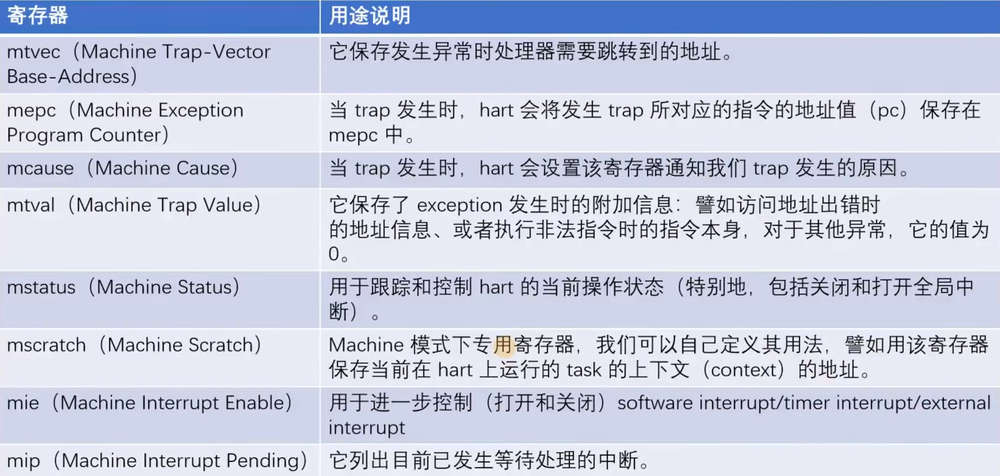

## CSR

CSR 指令是原子操作的，包含一系列寄存器：

mstatus: machine status, 它的 MPP 标志位 11 和 12，设置 CPU 运行模式：

- 1 机器模式
- 2 管理员模式
- 3 用户模式

写 CSR:
CSRRW: `csrrw t6, csr, t6`
csrw: 伪指令，csrw csr, rs，相当于`csrrw x0, csr, rs`

读 CSR:
CSRRS: `csrrw x5, mie, x6`；拆分解释 x5 = mie, mie |= x6
csrr: 伪指令，csrr rd, csr，相当于`csrs rd, csr, x0`

## 获取 Hart ID

`csrr t0, mhartid`

mhartid: machine hart id

## wfi 指令

进入休眠状态，知道接收到 CPU 中断才会唤醒

# Machine model CSR

## Trap 相关 CSR：

Trap: RISC-V 对 syscall、异常 ECF 和中断

