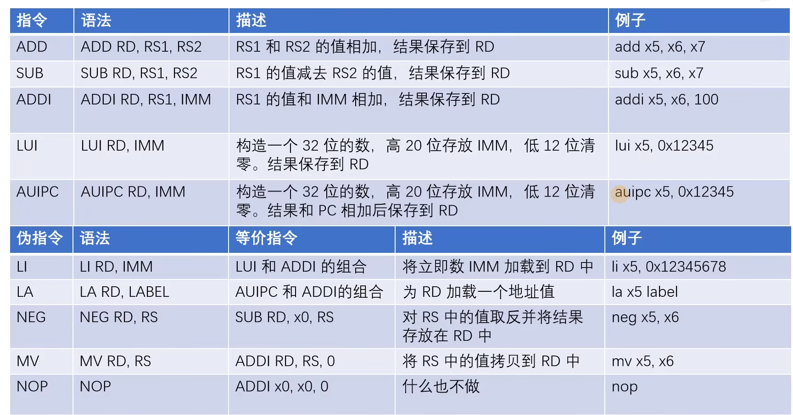
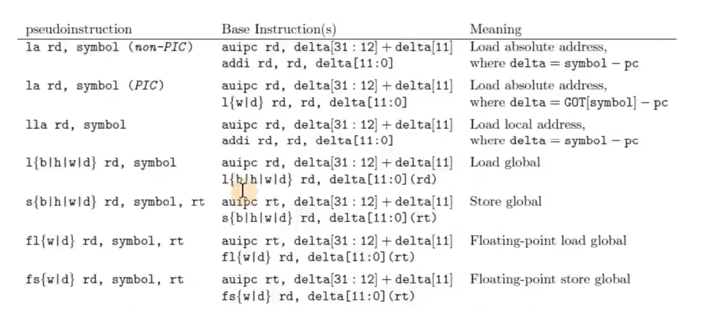
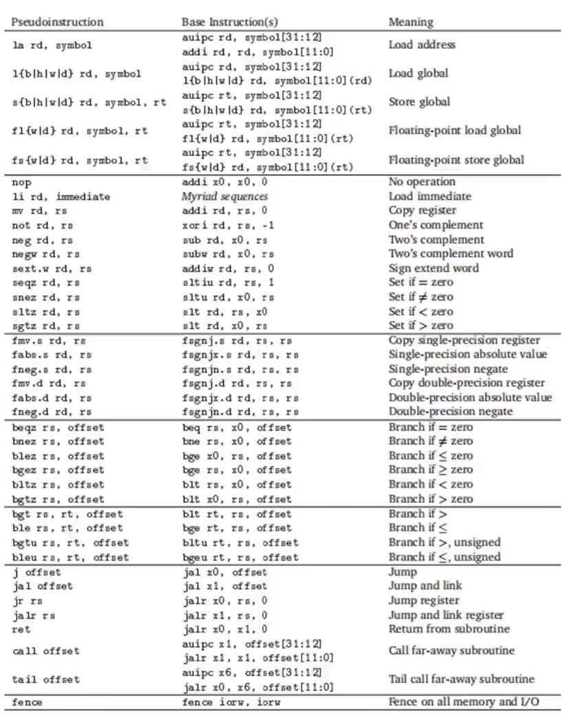

32 个通用寄存器，x0 ~ x31

RV32I: 基本整数指令集

Hart: 相当于一个最小的执行单元

## 6 种指令格式

## 常用指令

每条指令 4 字节

## ADD&SUb

减去一个正数就是加他的相反数

Add: 加法指令
ADDI: 加一个立即数，最大值 2^12，最大知识-2^11 ~ 2^11 - 1；
LUI: 构造一个 32 位立即数，清 0 低 12 位,相当于<<12；一般不直接使用，使用 LI 伪指令做大的立即数计算（封装 ADDI + LUI）
AUIPC: 和 LUI 一样，但是他完成 LUI 操作后，还要加上 PC 寄存器的值；一般不直接使用，使用 LA 伪指令（封装封装 + MV），完成一些相对地址的运算

算数运算指令:

## 伪指令

通常伪指令被翻译成多条汇编指令

NEG: 取反，等同于 sub rd, x0, rs
MV: 移动指令，等同于 addi rd,rs,0
NOP 空指令，占位指令 addi x0, x0, 0;

## 内存读写指令

> Load: 读，LB/LBU(8bit)、LH/LHU(16bit)、LW(32bit),后面带 U 的版本可以理解为无符号扩展

> Store: 写，SB、SH、SW

## 条件分支指令

Branch: BEQ、BNE、BLT、BLTU、BGE、BGEU; U 后缀代表无符号

条件分支伪指令：

常用指令：

一览：

