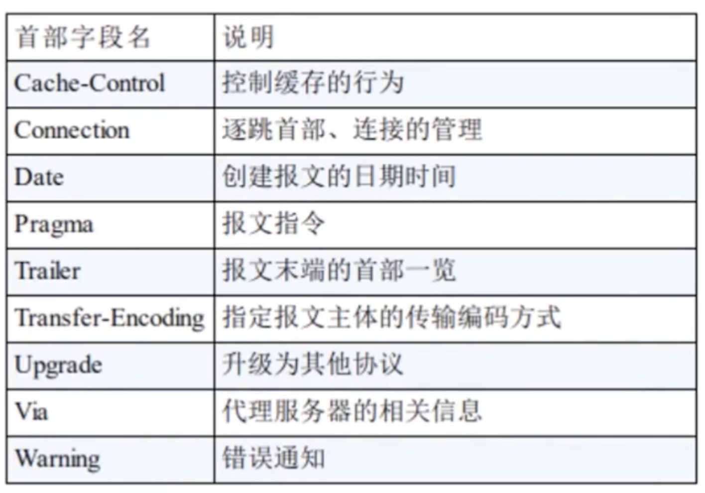
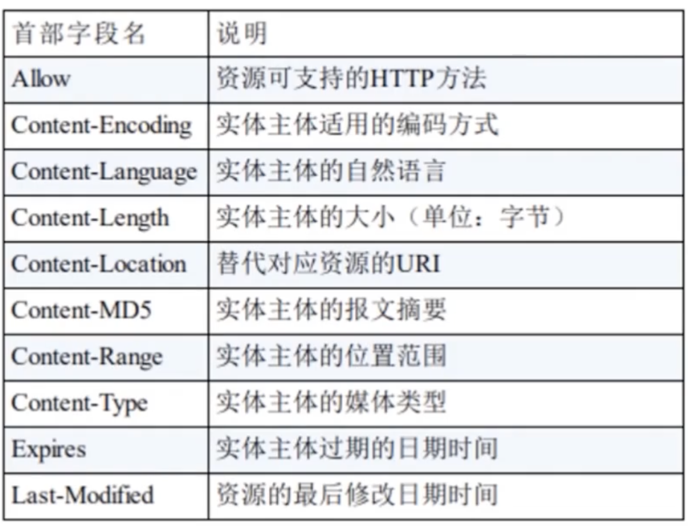

## HTTP3

基于 Quick 协议，基于 UDP

- 解决头了端阻塞问题

## 四类报文头

通用头、请求头、响应头、载荷/实体头

## 通用头

- Connection: `keep-alive`保持住 TCP 通道。`close`交换一次数据就关闭连接，再次发请求要重新经历三次握手；
- Cache-control: 控制缓存行为
  

## 请求头

- Content-Type: 发送的 payload 数据类型
- Accept: 申明接受响应的媒体类型；`/`任意类型；`text\html`文本。额外参数 `q=`表示权重，优先接受什么类型
- Accept-Encoding: 申明支持的压缩类型；`gzip,default`
- Accept-Language: 申明支持支持的语言，如果服务器无法提供这种语言的响应，返回的默认英文；
- User-agent: 告诉服务器本地使用的浏览器和操作系统信息

## 响应头

## 实体头

- PUT,DELETE 方法没有验证机制，不考虑再使用了
- HEAD 不会响应 payload，只响应报文头，一般用于连通性测试，探测工具
- CONNECT 创建双向通信的隧道；很不常用

## 状态码

- 1XX 很少使用
- 2XX 表示请求成功被接受
- 3XX 表示重定向，客户端需要进一步操作才能完成请求
- 4XX 客户端的请求，服务器无法理解，无法处理请求。身份认证、权限问题、资源找不到
- 5XX 服务器内部错误，在处理请求过程中出现了错误；
- 502 网关或代理错误

