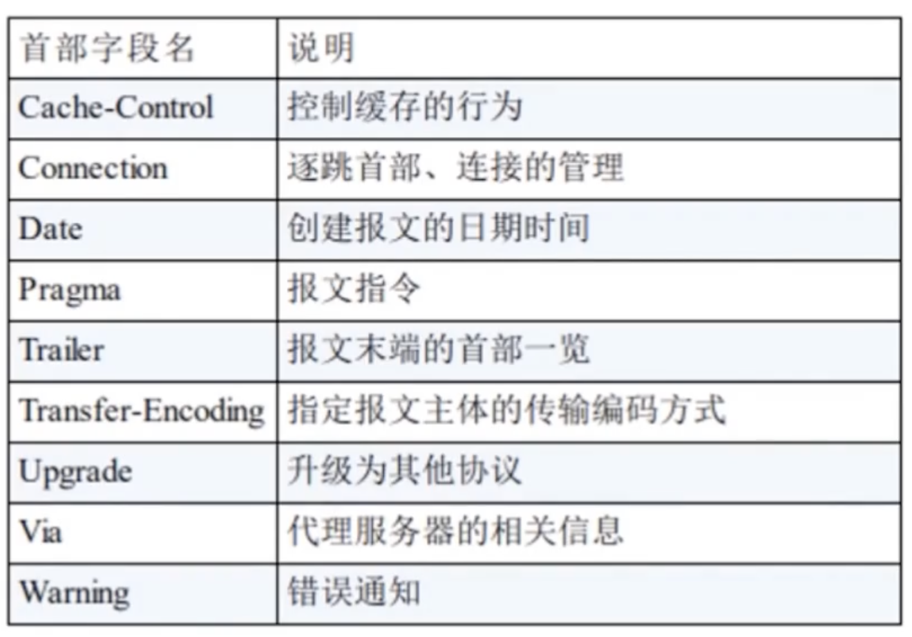
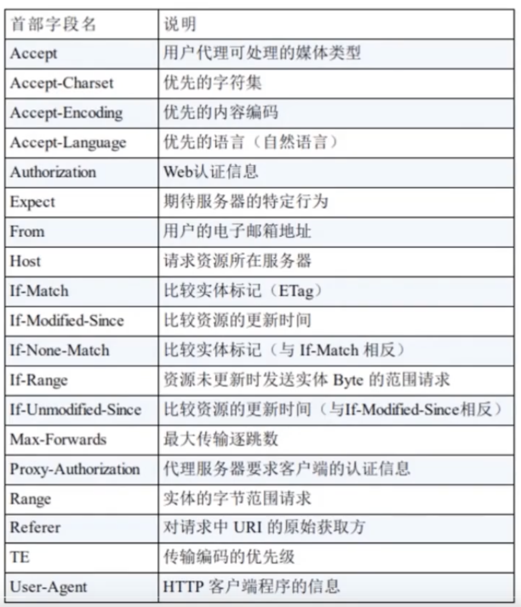
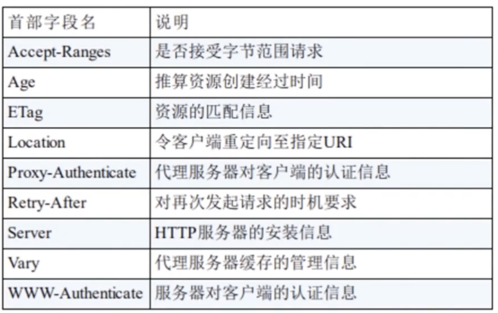
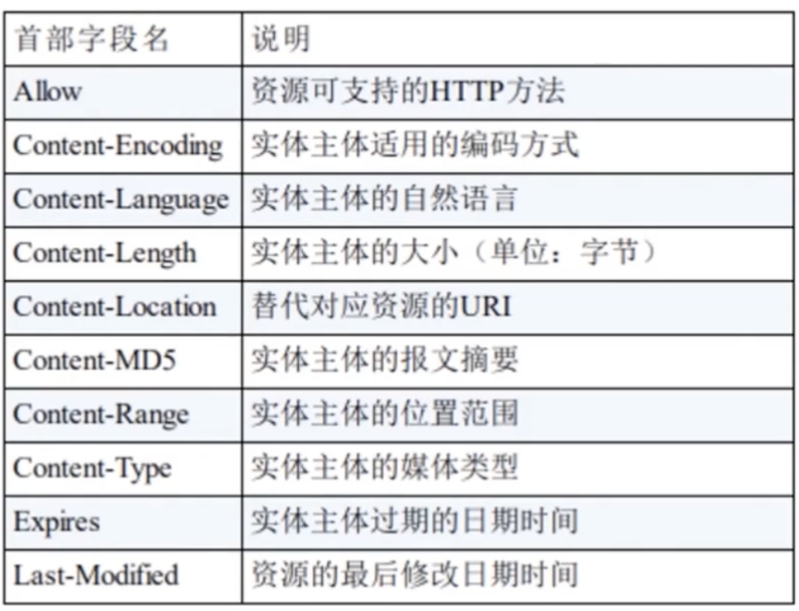

# 四类报文头

通用头、请求头、响应头、载荷/实体头

## 通用头

- Connection: `keep-alive`保持住 TCP 通道。`close`交换一次数据就关闭连接，再次发请求要重新经历三次握手；
- Cache-control: 控制缓存行为
  

## 请求头

- Accept: 申明接受响应的媒体类型；`/`任意类型；`text\html`文本。额外参数 `q=`表示权重，优先接受什么类型
- Accept-Encoding: 申明支持的压缩类型；`gzip,default`
- Accept-Language: 申明支持支持的语言，如果服务器无法提供这种语言的响应，返回的默认英文；
- Accept-Charset: 告诉服务器使用何种字符集
- Content-Type: 发送的 payload 数据类型
- User-agent: 告诉服务器本地使用的浏览器和操作系统信息，类型和版本号
- Referer：指定从哪个页面来访问当前请求的页面

## 响应头

- Content-Length：指定实体主体的大小
- Content-Encoding：实体编码
- Content-Language 响应内容的语言
- Content-Length：被发送对象的字节数
- Content-Type：标明对实体体对象的类型；如：html、binary、base64
- Date：指定响应的发送日期和时间
- Server：指定服务器的名称和版本号；标明允许服务的务器系统类型；类似请求报文中的 User-agent
- Connection: close 通知客户本次报文发送完后将关闭链接
- Date: 发送`报文`的日期时间（国标）
- Last-Modified: 标明对象创建或最后一次修改时间

## 实体头

当在讨论报文的时候，常被称作`对象`

> GET 请求时是空的
> POST 请求时，实体包含的内容为表单字段/值
> 

## Method

- PUT,DELETE 方法没有验证机制，不考虑再使用了
- HEAD 不会响应 payload，只响应报文头，一般用于连通性测试，探测工具
- CONNECT 创建双向通信的隧道；很不常用

PUT 方法，它允许客户上传对象到，Web 服务器上并指定路径
DELETE 方法，它允许客户删除对象到，Web 服务器上并指定路径
HEAD 方法，类似 GET，服务做出响应，但是不返回请求对象，通常用于调试
