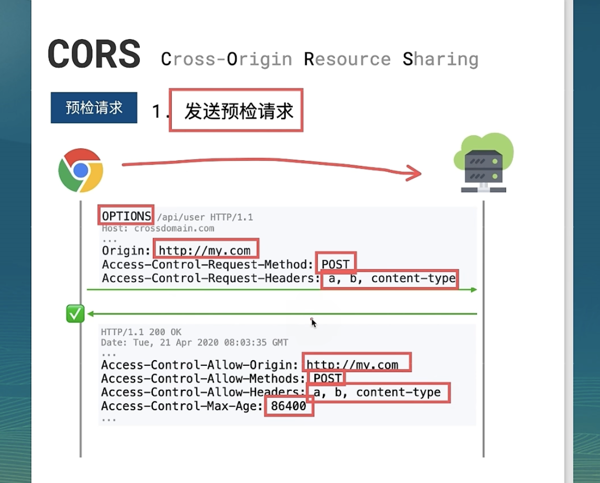

## CORS

什么是跨域/跨源？例如打开网站 A，这个网站使用 ajax 向不是同一个域名下的服务发起了请求，这就会发生跨域

既然是保护服务器的，CORS 问题通常需要服务端来解决：

> 解决方案

- `Access-Control-Allow-Origin:[option]`， `*`代表允许任意跨域请求;也可以指定特定域名；还可以放宽一些其他要求例如 Method 的类型
- `Access-Control-Allow-Headers` 指明哪些头部是被允许的
- `Access-Control-Expose-Headers` 指明响应头中哪些可以被跨域请求的客户端 JavaScript 访问。
- `Access-Control-Allow-Credentials` 允许跨域请求携带认证信息（如 Cookies）
- 使用反向代理，nginx
- 前段解决方案，JSONP，较复杂，需要客户端服务端代码都改动

为什么需要 CORS：

- 减轻服务器负载风险，不能任意人都来调用自己服务
- 保护隐私，防止不相干人访问自己数据

## CORS 原理

服务器在浏览器的配合下，限制那些域能访问自己

> 核心原理：需要请求头 `浏览器发送的Origin 与 服务端的Access-Control-Allow-Origin匹配`，设置`Access-Control-Allow-Origin: *`

正规合法的浏览器会在触发*预检*时:

1. 发送一个 `OPTIONS` 请求到服务端，设置头 `Origin: 当前域名`,告诉服务器存在危险，服务端如果检查不通过则 CORS 错误
2. 通过了服务器会返回一个时间，会允许一段时间直接访问它
3. 前端代码无法设置 Origin，发起跨域请求时浏览器自动行为

## 复杂、预检请求

复杂请求会导致浏览器发出触发 CORS 检查，浏览器行为；

简单请求要求规则，请求头直包含:

- Method:[GET|POST|HEAD]
- CORS 安全的头部: [Accept|Accept-Language|Last-Event-ID|Content-Language]
- Content-Type 仅限于: [application/x-www-form-urlencoded、multipart/form-data、text/plain]

PUT、DELETE、CONNECT、OPTIONS、TRACE、PATCH 等方法会触发预检。
自定义的头部会触发预检

## 识别预检请求

在 Chrome Network 请求条目 Method 显示 GET+**Preflight**就是预检请求
非必要的话服务端度应该避免预检请求，避免预检，因为可以提高响应速度，毕竟多一次请求；--ps 启示， 不要总想着用 app/json 发数据

## 允许认证信息

如果需要使用 Cookie 机制，服务端设置设置 withCredentials 为 True，以允许携带凭证机制。使用 Token 不需要开启
