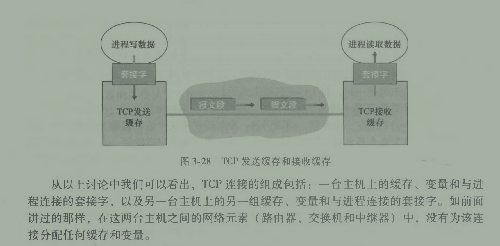

_建立`进程与进程之间`的通信_

TCP 20 字节头部，UDP8 字节

使其对上层来说无关环境，也就是说在上层眼里本地两个进程和端到端进程是一样的

面向连接，提供考考网络

tip: TCP 和 UDP 端口可以相同不会冲突

### MTU

MTU（最大传输单元，Max Transmission Unit, MTU）

发送主机本地的最大链路层帧的长度, 网络能够传输的最大数据包大小，**MTU 大小不包含链路层头部字节**

以太网为例，通常为 1500 字节。

**注意这是链路层设置的**

## MSS

_最大报文段长度，指报文段里应用层数据的最大长度_

通常被设置为，MTU - TCP 首部（20Byte） - IP 首部(20Byte，IPV6 占 40Byte) = payload 有效载荷
通常被设置为，发送主机本地的最大链路层帧的长度（最大传输单元，Max Transmission Unit, MTU）
MSS - TCP 首部（20Byte） - IP 首部(20Byte) = Body 可用长度

以太网和 PPP 链路层协议都具有 1500 字节的 MTU,所以 MSS 通常长度是 1460 字节

## 缓冲区

存储上层应用还没有读取的数据，上层会因为各种原因不能即使读取缓冲区数据

## TCP 队列头阻塞

因接收方 TCP 缓冲区满时造成，会导致丢包、延迟、重传、网络拥塞

串行化的 TCP 队列头阻塞，会导致网络拥塞；所以需要多路复用

## TCP 链接的组成

1. 进程数据
2. 套接字
3. TCP 缓存

## 全双工

一条 TCP 链接运行穿插的收/发，同发送序号(Seq)和接受确认号(ACK)，标识收发是否成功

## 流量控制

数据发送报文段中，通常`捎带`(piggybacked)空闲缓冲区 RevWin，这个通缓冲区大小减去这个已使用能计算对方剩余可用缓冲区
知道了对方剩余可用缓存区，就可以避免过多传送数据，造成带宽浪费

## TCP 报文段首部

最重要的部分是序号、确认号，他们 TCP 保证不失序、不丢失的核心要素

32bit（4byte）一个段落

1. 段落 1：2byte 源端口号，2byte 目的端口号
2. 段落 2：序号，Seq
3. 段落 3：确认号 ACK
4. 段落 4：4bit 首部长度，通常为 20(UDP 为 8)；由于段落 6 选项可选的（通常都是空的）,`TCP 报文段首部`长度是有可能的；还有 4bit 保留
5. 段落 4：1byte [标志位](#标志位)；
6. 段落 4：1byte 接受窗口，对方可以接受的字节数量
7. 段落 6：该字段用于发送方与接收方协商最大报文段长度(MSS)时使用
8. 段落 7：2byte 紧急数据指针，接受端接受到这个指针时，TCP 告知知它的上层——过时

#### 序号

_TCP 眼里数据就是一个无结构，有序的字节流_
代表 MSS 的在报文中起始地址,或者叫偏移量；计算公式：MSS 长度 \* (n-1)

#### 确认号

确认号实际就是接受到序号+段字节长度+1，也代表了下一个希望收到的序号
对于发送者他还代表了，在之前发送的序号已经被成功的接受到了

#### 标志位:

> ACK: 置位表示`确认号`有效；即一个报文段是否已被对方确认接受
> RST,SYC,FIN 用于建立/拆除链接
> CWR,ECE 用于拥塞通告
> PSH 被置位时，接收方应该立即把数据交给上层——过时
> URG 指示了报文段里有被发送端上层置位*紧急*的数据（紧急数据指针）——过时

# UDP

跟 IP 一样不可靠，简单的封装了 IP 协议，提供了能让数据报在进程之间传输的能力，不再是主机之间传输

应该就是进程 ID，socketfd, 回环地址之类的

## Socket

UDP Socket 是 2 元组，只和本地 (host，post) 绑定，发送消息时必须提供对方的 host:post，因此接受到消息时必须保存了对方的 host:post 才能回发数据

TCP Socket 是一个 4 元组标识，保存了和目标主机的会话关系，目标 host:post、信息，因为 TCP 是有链接的，需要保持一段时间的通信
