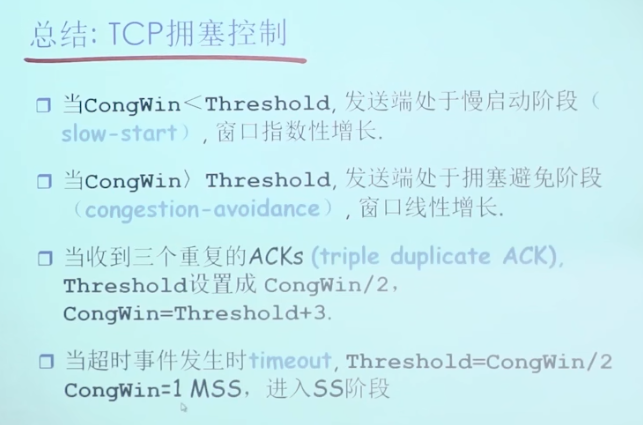
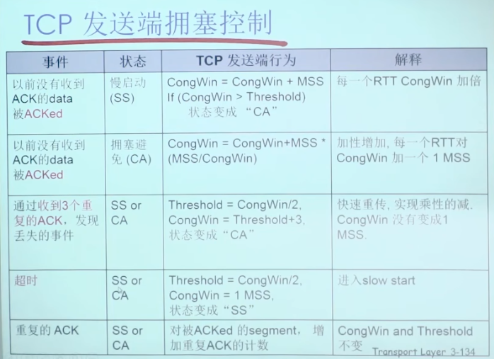

得益于各种机制，一条链路中所有的 TCP 链接，他们能够自动实现负载均衡

UDP 则是霸道抢占带宽

## congestion window

`cwnd` 拥塞控制窗口，MSS 的容器
如果 MSS 是 1460 字节并且 cwnd 是 14 600 字节，则在一 个 RTT 内发送 10 个报文段

## MSS

根据网络的 MTU（最大传输单元）减去 IP 头部和 TCP 头部的大小来确定的。例如，如果 MTU 是 1500 字节（常见于以太网），IP 头部和 TCP 头部通常占用 40 字节，那么 MSS 通常被设置为 1460 字节。

## 慢启动阈值 ssthresh 是多少

1. 链接初始阶段，应该是一个很大的值，不能妨碍慢启动
2. 发生超时，被设置为 cwnd 的一半
3. 快速回复，被设置为 cwnd 的一半+3 个 MSS 大小

## 慢启动

初始化拥塞窗口（cwnd）：TCP 连接建立时，拥塞窗口（congestion window, cwnd）被初始化为一个很小的值，如 1 个最大报文段大小（MSS）。

指数增长：每当一个报文段被确认，cwnd 增加一个 MSS 的大小。这意味着每个 RTT（往返时延），cwnd 翻倍，呈现出指数增长的趋势。这个阶段持续到 cwnd 达到一个阈值（ssthresh，慢启动阈值）。
_因此他并不慢，可以说是极快的.当一条 TCP 链接建立时，cwnd 通常为只可容纳 1 个 MSS，因此得名_

达到慢启动阈值：当 cwnd 大小达到或超过慢启动阈值（ssthresh）时，TCP 将不再进行指数增长，而是进入拥塞避免阶段。在拥塞避免阶段，cwnd 的增长将变为线性增长，即每个 RTT 仅增加 1 MSS，而不是翻倍。

发生超时：ssthresh 将被设置为发生拥塞时 cwnd 的一半，cwnd 重新设置为 1 MSS，然后 TCP 重新开始慢启动过程。
发生丢包: 通过接收到 3 个重复的 ACK 发现的（轻微的包丢失），TCP 将执行快速重传和快速恢复，而不是重新开始慢启动。

## 快速恢复

触发快速重传：此时网络可能发生了轻微的网络拥塞，为了避免 TCP 发生超时进入慢启动。
ssthresh 调整：将慢启动阈值（ssthresh）设置为 cwnd 的一半。
cwnd 调整： cwnd/2 + 3 个 MSS 的大小。
线性增加：随后进入拥塞避免模式

## 拥塞避免模式

由于发生了`快速重传`, 或者 cwnd 到达了阈值就会进入拥塞避免模式

cwnd 切换成线性增长，每个 RTT, size+1

_可以看出，网络拥塞控机制，一直在让网络在拥塞的边缘疯狂试探，尽可能让网络带宽处于饱和_

