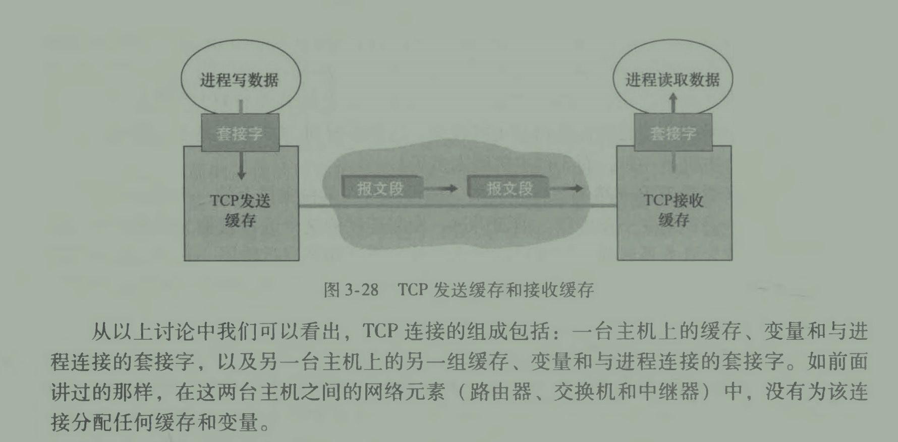

*建立`进程与进程之间`的通信*

使其对上层来说无关环境，也就是说在上层眼里本地两个进程和端到端进程是一样的

tip: TCP和UDP端口可以相同不会冲突

## MSS
*最大报文段长度，指报文段里应用层数据的最大长度*
通常被设置为，发送主机本地的最大链路层帧的长度（最大传输单元，Max Transmission Unit, MTU）
MSS - TCP首部（20Byte） - IP首部(20Byte) = Body可用长度

以太网和 PPP链路层协议都具有 1500 字节的 MTU,所以 MSS通常长度是 1460字节

## 缓冲区
存储上层应用还没有读取的数据，上层会因为各种原因不能即使读取缓冲区数据

## TCP队列头部阻塞
因接收方 TCP缓冲区满时造成，会导致丢包、延迟、重传、网络拥塞

## TCP链接的组成
1. 进程数据
2. 套接字
3. TCP 缓存

## 全双工
一条 TCP 链接运行穿插的收/发，同发送序号(Seq)和接受确认号(ACK)，标识收发是否成功

## 流量控制
数据发送报文段中，通常`捎带`(piggybacked)空闲缓冲区RevWin，这个通缓冲区大小减去这个已使用能计算对方剩余可用缓冲区
知道了对方剩余可用缓存区，就可以避免过多传送数据，造成带宽浪费

## TCP 报文段首部
最重要的部分是序号、确认号，他们 TCP 保证不失序、不丢失的核心要素

32bit（4byte）一个段落
1. 段落1：2byte源端口号，2byte目的端口号
2. 段落2：序号，Seq
3. 段落3：确认号ACK
4. 段落4：4bit首部长度，通常为 20(UDP 为 8)；由于段落6 选项可选的（通常都是空的）,`TCP 报文段首部`长度是有可能的；还有 4bit 保留
5. 段落4：1byte [标志位](#标志位)；
6. 段落4：1byte 接受窗口，对方可以接受的字节数量
7. 段落6：该字段用于发送方与接收方协商最大报文段长度(MSS)时使用
8. 段落7：2byte紧急数据指针，接受端接受到这个指针时，TCP 告知知它的上层——过时

#### 序号
*TCP 眼里数据就是一个无结构，有序的字节流*
代表 MSS 的在报文中起始地址,或者叫偏移量；计算公式：MSS长度 * (n-1)

#### 确认号
确认号实际就是接受到序号+段字节长度+1，也代表了下一个希望收到的序号
对于发送者他还代表了，在之前发送的序号已经被成功的接受到了

#### 标志位:
> ACK: 置位表示`确认号`有效；即一个报文段是否已被对方确认接受
> RST,SYC,FIN 用于建立/拆除链接
> CWR,ECE 用于拥塞通告
> PSH 被置位时，接收方应该立即把数据交给上层——过时
> URG 指示了报文段里有被发送端上层置位*紧急*的数据（紧急数据指针）——过时

# UDP
简单的封装了IP协议，跟IP一样不可靠，它让数据报在进程级别传输，不再是主机之间传输
