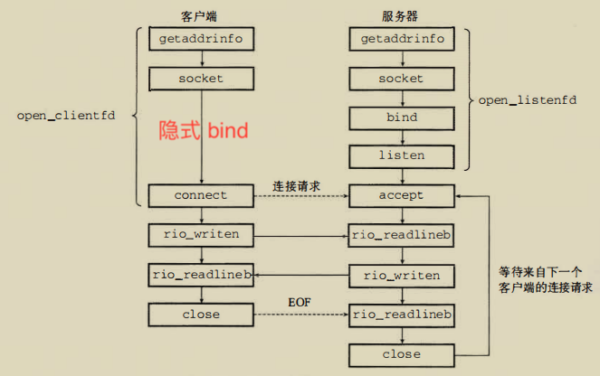

_套接字接口是设计可以运行在任意网络协议之上的，不只是 TCP/IP；--伯克利套接字_

_在网络之下，无论客户端还是服务端，没有主机的概念，他们是网络进程_

套接字函数通常被时实现为**系统调用**，因为某些功能需要深入到 0 特权级，调用内核模式的 TCP/IP 函数

## 创建 CS 链接步骤



## 套接字对

(chiadrr: cliport, servaddr: servport)
↓
(128.2.194.242: 555, 208.216.191: 666)

# 常见头文件

```c
#include <arpa/*.h>     // 应用层工具包
#include <netinet/*.h>  // 传输层工具包
```

# 网络工具函数

不同文件中也存在功能以及实现重叠的函数

**创建/链接**

```c
#include <sys/types.h>
#include <sys/socket.h>
/** getaddrinfo 辅助函数，生成下面一些函数的参数, success: 0 */
/** getnameinfo 辅助函数，生成下面一些函数的参数, success: 0 */

int socket(int, int , int)
// 会阻塞，成功返回*套接字对*
int connect(int, const struct sockaddr *, socklen_t)
// 将套接字描述符和套接字接口关联
int bind(int, const struct sockaddr *, socklen_t)
// 服务端使用它将套接字转换为被动套接字(监听)；设置协议接受缓冲区大小
int listen(int, int)
// 从监听到来的缓冲列队中取出一条链接，创建并返回已连接描述符
int accept(int ,const struct sockaddr *, socklen_t)
```

**大小端字序互转**

```c
#include <arpa/inet.h>

uint32_t htonl(uint32_t ); // 网络字节序，大端
uint32_t ntonl(uint32_t ); // x86体系，小端
```

**IP 地址和点分十进制互转换**
注意是的数值 IP 地址

```c
#include <arpa/inet.h>

int inet_pton(AF_INET, const char *src, void *dst)
const char* inet_ntop(AF_INET, const void *src, char *dst, socklen_t size)
```

# 网络工具结构

`_in` 后缀代表带着 Internet

**套接字结构**

```c
早期没有void*, 所以只能把特定协议的套接字结构的指针转成通用套接字结构指针来使用

struct sockaddr_in {
  uint16_t        sin_familu      // 协议簇；AF_INET
  uint16_t        sin_port        // TCP端口，网络端口号
  struct in_addr  sin_addr        // IP地址, 网络字节序
  unsigned char   size_zero[8]    // 填充字节，字节对齐
}

// 通用套接字地址结构
struct sockaddr {
  uint16_t        sa_familu       // 协议簇；AF_INET
  char sa_data[14]                //
}
```

# 命令收集

hostname -i; 局域网地址

nslookup 域名; 域名到 IP 的映射，一个域名可能多个 IP

# 术语

- 点分十进制表示法
  x.x.x.x, 其中 x ·····为十进制数

- 知名端口/服务名
  http 80/tcp； `/etc/services`中包含他们的映射
