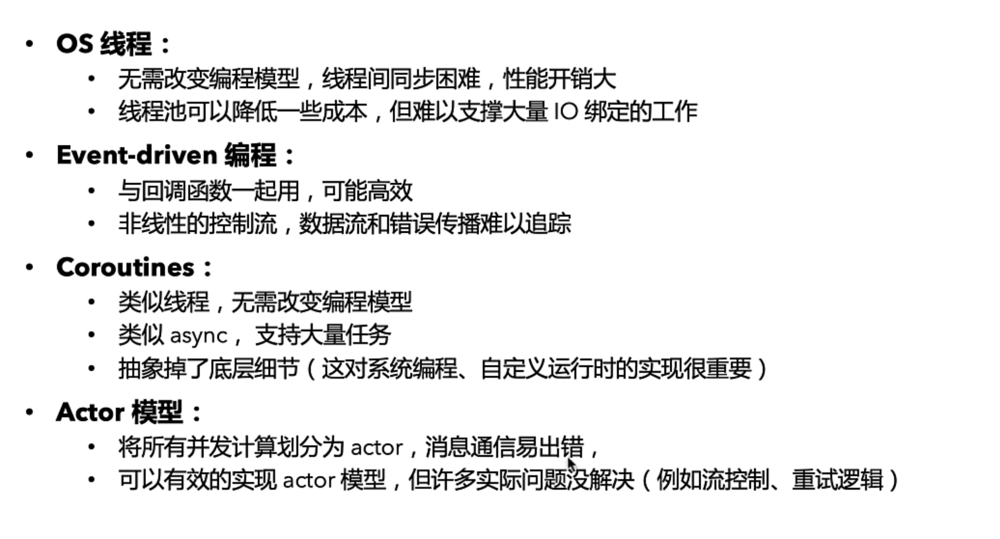

## Rust

Rust 的异步协程（Async/Await）：Rust 使用异步协程（通常通过 tokio 或 async-std 等异步运行时实现），这种模型是基于轻量级的任务（futures）和非阻塞 I/O。Rust 的异步任务是非常轻量级的，占用极少的内存，因此能够在单个程序中同时运行大量的异步任务。

## Go

Go 的 Goroutines：Go 语言中的 goroutines 是轻量级线程，由 Go 运行时进行管理。虽然每个 goroutine 的内存占用也相对较小（几 kb）,但是相对于 Rust 的异步任务来说，它们在内存占用上依然是比较显著的。因此，在达到几百万到千万级别的并发时，可能因为内存占用过大或运行时的限制而导致程序崩溃。

## 并发模型

rust async 、Goroutine 都是轻量级协程，还有一些其他的并发模型，在其他语言中可能是主流

